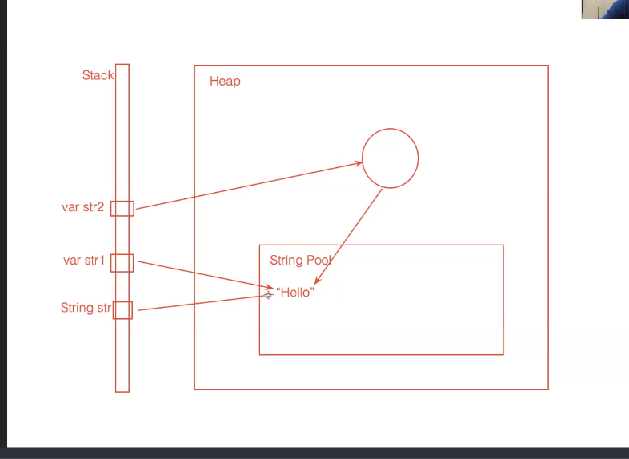

## Strings

- `Strings ဆိုတာ Character(Primitive char type )များအား အစိအစဉ်အလိုက်စုဤ အသုံးပြုနိုင်သော Oject type တစ်ခုဖြစ်ပါသည်`
- `Primitive Data Types အသီးသီိးတွင် သူတို့ကိုပိုင် သီးခြား   Literal (ဉပမာ size,value )များရှိကြပေမဲ့  Non-Primitive Types(Reference types) မှာတော့ null  Literal တစ်ခုပဲရှိကြတယ် `
- `Strings က  Oject type ဖြစ်ပေမဲ့   သူ့မှာ ကိုပိုင်  Literal ရှီတယ်`
- `Strings က  Oject type ဖြစ်တာကြောင့် lenght,toUpperCase  methods တွေကိုသုံးလို့ရတယ်`

> **`String တစ်ခု ကို Literal နဲ့ဆောက်ပါက String Pool Oject ကို သုံးသည် အဲ့လိုမဟုတ်ဘဲ String တစ်ခု ကို Object(new String()) နဲ့ဆောက်ပါက Heap Memroy ပေါ်မှာ Object တစ်ခုသက်သက်ဆောက်ပြီး Value ကို တော့ String Pool Oject ထဲက Value ကိုပဲပြန်ကြည့်ပါတယ် ` ** 
>
> **`String Pool  ထဲက value တွေကို တစိခုထက်မကသော variable  တွေက reference လုပ်နေနိုင်သောကြောင့် String များ Inmutabe  ဖြစ်ပါတယ်(String တစ်ခါဆောက်ပြီးရင် ပြန်ပြောင်းလို့မရအောင် Inmutabe လုပ်ထားတာ)  ။ String များ Inmutabe  ဖြစ်သောင်ကြောင့် String method များသည် မူလ String များကို မပြောင်ပဲ String တစ်ခုကို ပြန်ပေတယ်`**
>
> ` loop အတ္ငင်းမှ String တွေ ခနခန String ဆောက်ပြီး concatenating လုပ်တဲ့နေရာမှာ သုံးခြင်းအား JVM performance တတ်စေပါသည် ဘာကြောင့် ဒီလိုဘာလို့့လုပ်သင့်လည်းဆိုတော့ JVM မှာ String တစ်ခုဆောက်တိုင်း Heap Memoery ရဲ့ String pool ထဲမှာ နေရာယူနပါတယ်။  String pool ထဲ က String တွေက တစ်ခြား object တွေလို Stack Memory ပေါ်မှာ Reference လုပ်နေတာ မရှီတော့ရင် Heap Memoery ပေါက ဖျတ် GC က ဖျတ်ပစ်ပေမဲ့ String pool ထဲက String တွေက JVM နောက်ဆုံးချိနိထိ ရှီနေပါတယ် အဲ့လိုနောက်ဆုံးရှိနေအတွက် JVM performance  ကိုထိခိုက်စေပါသည်    `
>
> **`Primitive Data Types အသီးသီိးတွင် သူတို့ကိုပိုင် သီးခြား   Literal (ဉပမာ size,value )များရှိကြပေမဲ့  Non-Primitive Types(Reference types) မှာတော့ null  Literal တစ်ခုပဲရှိကြတယ် `**


### Create String

- `A String variable contains a collection of characters surrounded by double quotes`

  ```java
  // Create String with Litreal
  String nameone = "Name One"
  // Create String with Object    
  String nametwo = new String("Name Two");  
  ```


### How String Work

- `Java  တွင်  JVM Perfomance ထိန်းရန်အတွင် String Value များကို Heap Memory ပေါ်တွင် String Pool တစ်ခုတည်ဆောက်ဤ သိမ်းထားပါသည်။ `
- `String တစ်ခုဆောက်တိုင်း String Pool ပေါ်တွင် လက်ရှိ value နဲ့ တူတဲ့ value  ရှိလား မရှိလား စစ်ဆေးဤ ရှိခဲ့လျှင် မဆောက်တော့ပဲ မရှိရင်တော့ အသစ်ဆောက်ပေးပါသည် `
- `String တစ်ခု ကို Literal နဲ့ဆောက်ပါက String Pool Oject ကို သုံးသည် အဲ့လိုမဟုတ်ဘဲ String တစ်ခု ကို Object(new String()) နဲ့ဆောက်ပါက Heap Memroy ပေါ်မှာ Object တစ်ခုသက်သက်ဆောက်ပြီး Value ကို တော့ String Pool Oject ထဲက Value ကိုပဲပြန်ကြည့်ပါတယ် ` 
- `Literal အသုံပြုဤ ဆောက်သော String နဲ့ Objectကိုသုံးဤ ဆောက်သော String တို့ သည် Haap Memroy Reference လုပ်သော Object မတူသောကြာင့်  Value တူရင်တောင် == Opreator နဲ့ Compare လုပ်ပါက false ထွက်လိမ်  ။ String Value တူပြီး Object မတူတာတွေ Compare ချင်ရင်တော့ varname1.equals(varname2)  ကိုသုံးလို့ရပြီး result သည် လည်း true ထွက်ပါပြီ။`
- `String Pool Oject ထဲမှာရှိသော String တစ်ခုကို  တစ်ခုထက်မကသော  Variable တွေက Refernece လုပ်နိုင်သော ကြောင့် String တွေသည် Imutable ဖြစ်သည် `




### Text Block(Multi line String)

- `Java 15 ကနေစပြီး Multi line String တွေကို Literal အနေနဲ့ရေးနိုင်လာပါသည် ထိုအရာကို Text Block ဟုခေါ်နိုင်ပါသည်`

- `Java တွင် String တစ်ခုရေးတိုင်း JVM က Heap Memory ပေါ်က String Pool ပေါ်တွင်နေရာ သွားယူတယ် ။ Heap Memory ပေါ်က String Pool ထဲ  String တွေက တခြား Object မတူဘူး ။ တခြား Object တွေက Reference လုပ်နေတဲ့ Variable မရှိတော့ဘူးဆိုရင်  Garbage Collector က Heap Memory ပေါ်ကနေဖျတ်လိုက်တယ် ဒါပေမဲ့ String Pool ထဲမှာရောက်နေတဲဲ့ String Object တွေကိုတော့ Garbage Collector က ဖျတ်မပေးနိုင်ပါဘူး နောက်ဆုံး JVM run တဲ့အထိရှိနေပါတယ် အဲ့လို Reference လုပ်နေတဲ့ Variable  မရှိဘဲ Heap Memory မှာနေရာယူနေတဲ့အတွက် Performance ထိခိုက်စေပါတယ် ။  ဒါကြောင့် String တွေ Concatenation လုပ်ရင် + Operator သုံးပြီး  String Literal  တစ်ခုခြင်း Concate လုပ်တာထက် Text Block(Multi line String) သုံးတာက ပိုကောင်းပါတယ် ။ ပြီးတော့ Operator Precedence ကြောင့် String တွေထပ်တိုး ပြီးHeap Memory ပေါ်မှာ နေရာသွားယူတယ်`

- `Multi line String သည် Left and right space တွေကို ဖျတ်ထုတ်ပေးသွားတဲ့အတွက် sql string တွေရေးရင် သတိထားသင့်ပါသည်`

  
  
  ```java
  //ဒီလိုရေးလို့မရပါ 
  var sql = """ SELECt * FROM users
  WHERE name like ? AND age > 20 OR age < 30;"""
     
  //အောက်တစ်လိုင်းဆင်ပေးရမယ် (Delimeterပါရမယ်)    
  var sql = """ 
  SELECt * FROM users
      WHERE name like ? AND age > 20 OR age < 30;"""
          
  //နောက်ဆုံးလိုင်းကို အောက်တစ်လိုင်းမဆင်းပေးသင်        
  var sql = """ 
  SELECt * FROM users
      WHERE name like ? AND age > 20 OR age < 30;
  	"""            
      
  ```
  


### Java String Method and Properties

- :warning:  String များသည် Inmutalbe ဖြစ်တာကြောင့် String Method များသည်  နာဂိုမူရင်း String ကိုပြောင်းမသွားဘဲ String အသစ်တစ်ခုပြန်ပေးပါတယ်

  ```java
  jshell> str.
  charAt(                chars()                codePointAt(           
  codePointBefore(       codePointCount(        codePoints()           
  compareTo(             compareToIgnoreCase(   concat(                
  contains(              contentEquals(         describeConstable()    
  endsWith(              equals(                equalsIgnoreCase(      
  formatted(             getBytes(              getChars(              
  getClass()             hashCode()             indent(                
  indexOf(               intern()               isBlank()              
  isEmpty()              lastIndexOf(           length()               
  lines()                matches(               notify()               
  notifyAll()            offsetByCodePoints(    regionMatches(         
  repeat(                replace(               replaceAll(            
  replaceFirst(          resolveConstantDesc(   split(                 
  startsWith(            strip()                stripIndent()          
  stripLeading()         stripTrailing()        subSequence(           
  substring(             toCharArray()          toLowerCase(           
  toString()             toUpperCase(           transform(             
  translateEscapes()     trim()                 wait(         
  ```

  


### Converting to Strings

- `Primitive type ကနေ String ကို ပြောင်းချင် String Wrapper Class ကိို သုံးနိုင်သည်။ Wrapper Class များ java.lang package အောက်တွင်ရှိသည် `

  ```java
  //Integer to String
  String myString = myInt1.toString();
      
  //String to Ineger           
  int myint1 = Integer.valueOf('123');      
  int myint = Integer.parseInt('123'); //(Integer.parseInt နဲ့ ပြောင်းချင် ရင် comma တွေ _ တွေပါလို့မရ)
      
  //String to double
  double d1 = Double.valueOf('123.323');      
        
  //Flato to String
  Float d2 = 123.34;
  String s1 = d2.toString();
      
  //Shot to String
  Shot ss1 = 8993;
  String s2 = String.valueOf(ss1) 
  ```

  


### Find String Methods

> :warning: **`Java တွင် Strging Method တွင် Method  override နည်းနဲ့ ရေးထား indexOf နာမည်တူ လေးခုရှိသည် `**
>
> - `indexOf(int ch)`
> - `indexOf(int ch,int formIndex)`
> - `indexOf(String str)`
> - `indexOf(String str,int formIndex)`

- `indexOf(int ch)` 

- `indexOf(String str)`

- `indexOf(int ch,int fromIndex)`

- `indexOf(String str,int fromIndex)`

- `lastIndexOf(int ch)`

- `lastIndexOf(int ch,int fromIndex)`

- `lastIndexOf(String str)`

- `lastIndexOf(String str,int fromIndex)`

  ```java
  String txt = "Please locate where 'locate' occurs!";
  System.out.println(txt.indexOf("locate")); // Outputs 7
  ```

  

### Checking String Methods

-  `endWith(String suffix)`

- `startsWith(String prefix)`

- `starsWith(String suffix,int offset)`

- `contains(CharSequence seq)`

- `equals(Object object)`

- `equalsIgnoreCase(String anotherString)`

- `isBlank()`

- `isEmpty()`

- `reginMatch(int toOffset,String other,int offset,int len)`

- `reginMatch(bloolean ignorecase,int toOffset,String other,int offset,int len)`

  ```java
  String str ="profile.png";
  str.endsWith("png"); 		//Will return boolean value
  str.endsWith("jpeg"); 		
  
  str.starsWith("file",3)
      
  str.contains("file")
  
  String empty = "";
  empty.isEmpty(); //true
  empty.isBlank(); //true
  
  String blank = "     ";
  blank.isEmpty(); //false
  blank.isBlank(); //true
    
  //String တစ်ခုတွင် Blank ပါလားမပါလားစစ်ခြင်း    
  if(name == null || name.isEmpty() || name.trim().isEmpty()){
  }    
  //String တစ်ခုတွင် Blank ပါလားမပါလားစစ်ခြင်း ကို isBlank() တစ်ခုထဲနဲ့လုပ်နိုင်တယ်
  if(name == null || name.isBlank()) // from java 11
  
      
  String greet1 = "Hello";
  String greet2 = "Hello";
  String greet3 = new String("Hello");
  //Compare
  greet1 == greet2 //true
  greet1 == greet3 //flase (value တူပေမဲ့ Oject မတူ)
  greet1.equals(greet3) //true (Oject မတူပေမဲ့ value တူလား စစ်ချင်ရင် equals() method ကိုသုံးနိုင်တယ်)
  
  String str1 = "HELLO";
  String str2 = "hello";
  str1.equalsIgnoreCase(str2) //True
  
  
  var str1 = "Hello Java";
  var str2 = "Java Hello";
  var str3 = "HELLO JAVA";
  str1.regionMatches(0,str2,5,5) //ture (တစ်စိတ်တစ်ပိုင်းတူရင် true ပြန်ပေးတယ်)
  str3.regionMatches(true, 0,str2,5,5) //ture    
  str3.regionMatches(false, 0,str2,5,5) //false        
  
  
  String txt = "ABCDEFGHIJKLMNOPQRSTUVWXYZ"
  System.out.println(txt.length());    // String Length
  System.out.println(txt.toUpperCase()); // Change to Uppercase
  System.out.println(txt.toLowerCase());  // Change to LowerCase
  
  String fn = "Spidye";
  String ln = "Shine"
  System.out.println(fn.concat(ln)); // Concatination
  
  //compareTo
  var d1 = "10";
  d1.compareTo("10") // output => 0
  d1.compareTo("11") // output => -1    
  d1.compareTo("01") // output => 1
  d.compareTo("5") // output => -4
  
  
  ```
  


### Replacting Character Methods

- `replace(char oldChar,char newChar)` : `return type => String`

- `replace(CharSequence target, CharSequence replacement)` : `return type => String`

- `replaceAll(String regex,String replacement)` : `return type => String`

- `replaceFirst(String regex,String replacement)` : `return type => String`

  ```java
  jshell > String str = "Hello Java,Hi JDC";
  jshell > String copy = str.replace('o','E'); // HellE Java,Hi JDC
  
  jshell > str //"Hello Java,Hi JDC";  original string ပြောင်းမသွားပါ
  
  jshell > String copy1 = str.replace('H','P'); // PellE Java,Pi JDC    
  
  jshell > String copy2 = str.replace('o','E'); // HellE Java,Hi JDC
  
  jshell > String str2 = "123ooooi09ppoii12-0930"
  
  //replaceAll က pattern နဲ့ Search လုပ်ပေးနိုင်တယ် ( ရိုးရိုး replace က pattern မရ)   
  //digit 3 လုံရှိတဲ့နေရာမှာ အစာထိုးလိမ်(d က digit ကို ဆိုလိုတယ်)    
  jshell > String copy3 = str2.replaceAll("\\d{3}","QQQ") 
  jshell > copy3 //QQQooo109ppoiiQQQ-QQQ
  
      
      
  ```

  


 ### Sub String Methods

> Sub String များသည် နာဂိုမူရင်း String ကိုပြောင်းမသွားဘဲ String အသစ်တစ်ခုပြန်ပေးပါတယ်

- `subString(int beginIndex) : return type -> String`

- `subString(int beginIndex,int endIndex) : return type -> String`

- `subSequence(int beginIndex,int endIndex) : return type -> CharSequence`

  ```java
  var str ="Hello Java"
  var sub1 = str.substring(1,5)  //ello
  var sub2 = str.subSequence(1,5)  //ello    
  
  sub1 = sub2 //false
  
  sub1.equals(sub2) //true    
  
  String sub4 = sub1  // ello
     
  // subSequence နေရမှာ String တွေကို အစားထိုးလို့ ရ ပေမဲ့ String နေရမှာ subSequence တွေကို အစားထိုးလို့မရ
  String sub3 = sub2  //error    
  ```
  
  > `subSequence နေရမှာ String တွေကို အစားထိုးလို့ ရတယ်`
  >
  >  `String နေရမှာ subSequence တွေကို အစားထိုးလို့မရ ။ ဒါဘာကြောင့်လည်းဆိုတော့ String က subSequence Interface ကို Inplements လုပ်ထားတာကြောင့်ပါ `


### Other  Usefull String Methods 

- `trim() ` : `Return Type => String`

- `toLowerCase() ` : `Return Type => String`

- `toLowerUpperCase() ` : `Return Type => String`

- `split(String regex) ` : `Return Type => String[]`

- `split(String regex,int limit) ` : `Return Type => String[]`

- `concat(String) ` : `Return Type => String`

  ```java
  jshell > var str = "  \tHello Java\t Hey\" // \ mean tag
  jshell > System.out.println(str)    
      	  Hello Java      Hey
  
  jshell > var trimresult = str.trim() // trim သည် ရှေ,နဲ့ နောက်ဆုံးက space တွေ tag တွေကို ပဲ ဖျတ်ပေးနိုင်တယ်
  Hello Java\t Hey
  
  jshell> var userStringArry = userData.split(",");
  userStringArry ==> String[4] { "Spidey", "097777888", "example@gmail.com", "Yangon" }
  
  var fname = "Spider";
  var lname = "man";
  fname.concat(lname) //Spiderman
  
  ```

  


### Concatenation and Addition

- **`Strng များကို Concatenation ရင်  + operator ထက် Multiline String (Text Block) ကိုသုံးသင့်သည်`**

- `Java 15 ကနေစပြီး Multi line String တွေကို Literal အနေနဲ့ရေးနိုင်လာပါသည် ထိုအရာကို Text Block ဟုခေါ်နိုင်ပါသည်`

- `Java တွင် String တစ်ခုရေးတိုင်း JVM က Heap Memory ပေါ်က String Pool ပေါ်တွင်နေရာ သွားယူတယ် ။ Heap Memory ပေါ်က String Pool ထဲ  String တွေက တခြား Object မတူဘူး ။ တခြား Object တွေက Reference လုပ်နေတဲ့ Variable မရှိတော့ဘူးဆိုရင်  Garbage Collector က Heap Memory ပေါ်ကနေဖျတ်လိုက်တယ် ဒါပေမဲ့ String Pool ထဲမှာရောက်နေတဲဲ့ String Object တွေကိုတော့ Garbage Collector က ဖျတ်မပေးနိုင်ပါဘူး နောက်ဆုံး JVM run တဲ့အထိရှိနေပါတယ် အဲ့လို Reference လုပ်နေတဲ့ Variable  မရှိဘဲ Heap Memory မှာနေရာယူနေတဲ့အတွက် Performance ထိခိုက်စေပါတယ် ။  ဒါကြောင့် String တွေ Concatenation လုပ်ရင် + Operator သုံးပြီး  String Literal  တစ်ခုခြင်း Concate လုပ်တာထက် Text Block(Multi line String) သုံးတာက ပိုကောင်းပါတယ် ။ ပြီးတော့ Operator Precedence ကြောင့် String တွေထပ်တိုး ပြီးHeap Memory ပေါ်မှာ နေရာသွားယူတယ်`

- `Multi line String သည် Left and right space တွေကို ဖျတ်ထုတ်ပေးသွားတဲ့အတွက် sql string တွေရေးရင် သတိထားသင့်ပါသည်`

  ```java
  String fn = "Spidye";
  String ln = "Shine"
  System.out.println(fn + " " + ln)
      
  //If you add two numbers, the result will be a number:
  int x = 10;
  int y = 20;
  int z = x + y;  // z will be 30 (an integer/number)    
      
  //If you add two strings, the result will be a string concatenation:    
  String x = "10";
  String y = "20";
  String z = x + y;  // z will be 1020 (a String)    
      
      
  //If you add a number and a string, the result will be a string concatenation:
  String x = "10";
  int y = 20;
  String z = x + y;  // z will be 1020 (a String)
  ```


### Strings - Special Characters

| Escape character | Result | Description  |
| :--------------- | :----- | :----------- |
| `\'`             | '      | Single quote |
| `\"`             | "      | Double quote |
| `\\`             | \      |              |

| Code | Result          | Try it                                                       |
| :--- | :-------------- | :----------------------------------------------------------- |
| \n   | New Line        | [Try it »](https://www.w3schools.com/java/tryjava.asp?filename=demo_strings_newline) |
| \r   | Carriage Return | [Try it »](https://www.w3schools.com/java/tryjava.asp?filename=demo_strings_r) |
| \t   | Tab             | [Try it »](https://www.w3schools.com/java/tryjava.asp?filename=demo_strings_tab) |
| \b   | Backspace       | [Try it »](https://www.w3schools.com/java/tryjava.asp?filename=demo_strings_b) |
| \f   | Form Feed       |                                                              |


