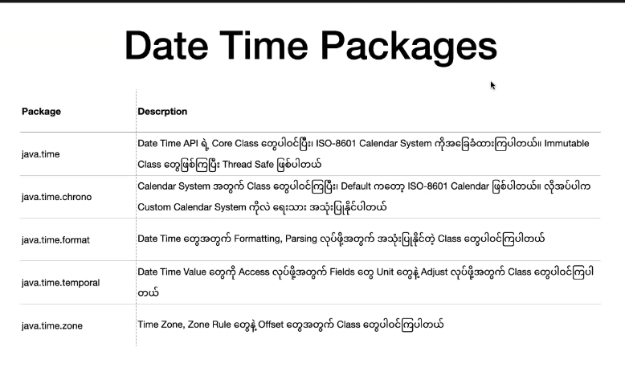
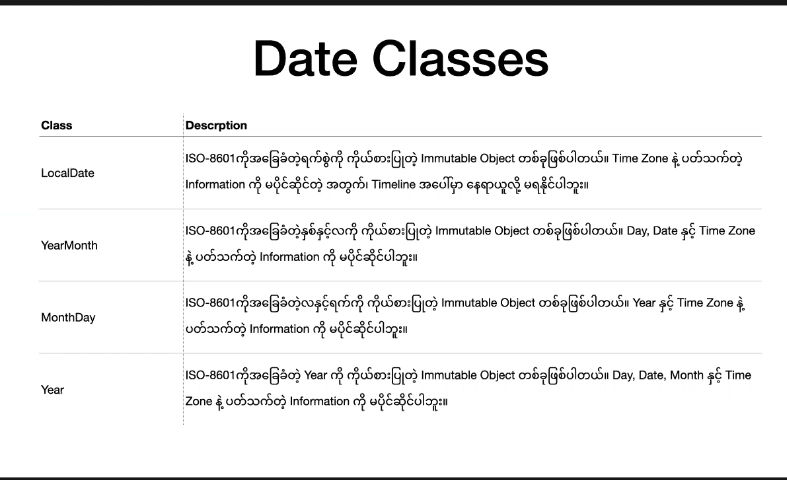

##  Date & Time API

- `Java 8 မှာ Lambda Expression နှင့်အတူ Date & Time API ကိုလဲ ဖြည့်စွက်ခဲ့ကြပါတယ်`
- `Java မှာ န ဂိုကထဲက Date Time တွေကို အသုံးပြုဖို့အတွက် java.util.Date နဲ့ java.util.Calendar နဲ့ Database Type တွေအတွက် java.sql.Data တွေကို သုံးပြုခဲ့ကြပါတယ်`
- ``ဒါပေမဲ့ java.util.Date နဲ့ java.util.Calendar တို့ဟာ အသုံးပြုရတာခက်ခဲပြီးတော့၊ Thread Safe မဖြစ်ဘူး ၊ တကမ္ဘာလုံးမှာရှိတဲ့ Calendar တွေနဲ့ ကိုက်ညီမှူမရှိဘူး ဆိုတဲ့ အားနည်းချက်တွေရှိခဲ့ကြပါတယ်`
- `ဒါကြောင့် Java Application အတော်များများ Open Source Libaray တစ်ခုဖြစ်တဲ့ Joda Time API ကို အသုံးပြုခဲ့ကြပါတယ်`
- `Java 8 အရောက်မှာတော့ Joda Time API ကို အခြေခံပြီး JSR 310 အနေနဲ့ JRE ရဲ့  Standar Specificaton အဖြစ်ဖြည့်စွက်ခဲ့ကြတာ ဖြစ်ပါတယ်`


### Date & Time API Design Principle

- Date & Time API ကို Clear,Fluent , Immutable, Extensible ဖြစ််အောင်ရေးခဲ့ကြတယ်


### Date & Time API Basic Concept


### Date & Time API Design Principle

- `Date & Time API ကို Internation Starndard နဲ့ညီအောင် ISO-8601 Gregorian Calendar အခြေခံ ရေးသားထားပါတယ်`


### Date & Time API Package 




### Date & Time API Class

- **Date & Time API Class များသည်Temporal Package အောက် က TemporalAccessor Interface ကို  Implement လုပ်ထားကြပါတယ် ။ ဒါကြောင့် Date & Time API Class တွေကို TemporalAccessor အဖြစ်သုံးနိုင်တယ်**
- **Temporal သည် TemporalAccessor Interface ကို  Implement ပြီး Time တွေကို Adjust လုပ်လို့ရတဲ့ TemporalAdjusters Class ဖြစ်တယ်**
- **Instant Class သည် Mechain Time ကို ကိုယ်စားပြုတဲ့ Class ဖြစ်ပါတယ်**
- **LocalDateTime Class သည် ISO-8601 Internation Standard ကိုက်ညီတဲ့ Class ဖြစ်ပြီးတော့ အသုံးများစုံးClass လည်းဖြစ်ပါတယ်။ LocalDate Class ရယ် Localtime ရယ်နဲ့တွဲပြီးတော့သုံးလေ့ရှိပါတယ်**
- **ChronoLocalDate ကိုတော့ Calendar နဲ့ပါတ်သက်တဲ့ Class ဖြစ်တယ်,ဉပမာ ရက်တစ်ရက် ဒီလရဲ့ နောက်ဆုံးဖြစ်သလားလို့ စစ်ချင်တာတွေကို သုံးလို့ရတယ်**
- **Monthday Class ကိုတော့ ဒီလမှာ ဒီရက်ရှိလားလို့ စစ်ချင်တဲ့နေရာမှာသုံးနိုင်တယ်**


### Machine Date Time


### Human Date Time


### Date Class




### Time Zone & Offset Class


### Create Date Time

- `Date and Time API ကိုသုံးချင်ရင်  java.time package ကို Import လုပ်ပေးရမယ်, `
- `Legacy Date Class တွေဖြစ်တဲ့ Date Object နဲဲ့ Calendar Object သည် Month များကို တွက်ရာတွင် 0 မှစသည်  Date and Time API မှာတော့ 1 ကနေစပါသည်`


- Date Time API Class အများစု တွေသည် အောက် Factory Methods မျးပါပါသည်


```java
import java.time.*
    
var dateTime = LocalDateTime.now(); //2023-08-08T21:02:07.554127

var localDate = LocalDate.now(); //2023-08-08

var localTime = LocalTime.now(); 21:03:46.611445
    
Instant.now(); //2023-08-08T14:34:32.919466Z

ZonedDateTime.now(); //2023-08-08T21:04:48.760386+06:30[Asia/Yangon]

OffsetDateTime.now(); //2023-08-08T21:04:58.203832+06:30

YearMonth.now(); //2023-08

MonthDay.now(); //--08-08

Year.now(); //2023

//Legacy Date Class တွေဖြစ်တဲ့ Date Object နဲဲ့ Calendar Object သည် Month များကို တွက်ရာတွင် 0 မှစသည်  Date and Time API မှာတော့ 1 ကနေစပါသည်`
var cal = Calendar.getInstance();
cal.get(Calendar.MONTH);
cal.getTime(); //Tue Aug 08 21:14:26 MMT 2023
cal.set(Calendar.MONTH,11); 11  လပိုင်းလို့ သက်မှတ်ပေမဲ့ 12လပိုင်းဖြစ်သွားပါသည်
cal.getTime(); //Fri Dec 08 21:14:26 MMT 2023

//  Date and Time API  Month မှာတော့ 1 ကနေစပါသည်`
LocalDate.of(2023,11,21); 2023-11-21
ZonedDateTime.of(..)
LocalDateTime.of(...)    
OffsetDateTime.of(..)

```

