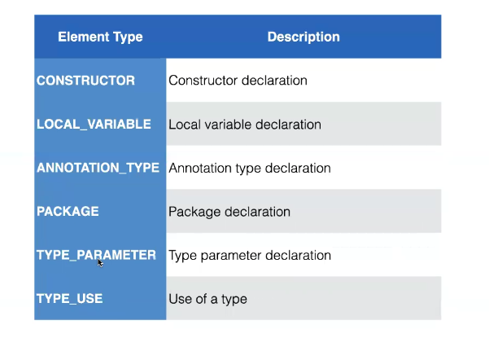
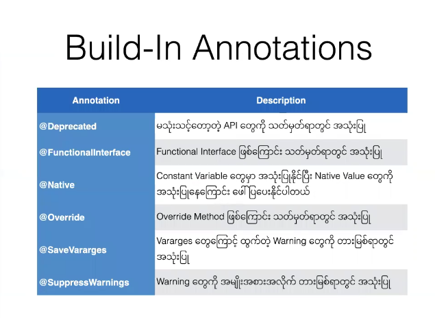

## Annotation

> **`Annotation ကို သုံးပြီးရေးတဲ့ User တွေဆီက Information  တွေယူချင်တယ်ဆိုရင် Metehod Annotation ရေးထားလို့ရတယိ `** 

### What is Annotation


### Write Custom Annotation

- **`Method များတွင် Parameter များလက်မခံပါ Return type သည်လည်း Primitive Type String , Class,enum,Annotation နှင့် အဆိုပါအမျိူအစားများ၏ Array များကိုသာ အသုံးပြုနိုင်သည်`**

  ```java
  // အောက်ပါတွင် code intval , str တို့သည် Method  များဖြစ်ကြပါသည် 
  //Method များတွင် Parameter များလက်မခံပါ Return type သည်လည်း Primitive Type String , Class,enum,Annotation နှင့် အဆိုပါအမျိူအစားများ၏ Array များကိုသာ အသုံးပြုနိုင်သည်
  @interface Hello{
      //void    value(); //void Return type ရေးလို့မရပါ
      int     intval();
      String  str();
  }
  @Hello(intval=123,str="HI")
  class User{
  }
  
  
  //value method
  //Method Name သည် value ဆို့တဲ့နာမည်ဖြစ်ပြီး Method က လည်း တစ်ခုပဲပါရင် ထို Annotatiojn ကိုပြန်သုံးရင် Method Name မပေးလည်းရတယ်
  @interface AnnotationMethodWithValueName{
      String value();
  }
  @AnnotationMethodWithValueName("heoll")
  class User{
  }
  
  
  // DefautValue
  //Method Name သည် value ဆို့တဲ့နာမည်ဖြစ်ပြီး Method က လည်း တစ်ခုပဲပါရင် ထို Annotatiojn ကိုပြန်သုံးရင် Method Name မပေးလည်းရတယ်
  @interface DefautValue {
      String value() default "hi this is defautl value from annotation method";
  }
  //@DefautValue ဒီလိုရေးလို့မရ (java 11)
  @DefautValue()
  class User{
  }
  
  
  //Primitive type Array
  @interface AraryValue {
      String[] value() default {"hi this is defautl value from annotation method"};
  }
  
  //@AraryValue ဒီလိုရေးလို့မရ (java 11)
  //@AraryValue() // တန်ဖိုးမသတ်မှတ်လည်းရတယ်
  @AraryValue({"str1","str2","str3"}) // တန်ဖိုးသတ်မှတ်လည်းရတယ်
  class User{
  }
  ```

  


### What is  Meta-Annotation

- **`Java တွင် Meta-Annotation  များသည် java.lang.annotation Package အောက်က တွင်ရှိသည်`**


#### Type of Meta-annotation


#### @Documented Meta-Annotation

- **`Documnted Annotation သုံးပြီးရေးလိုက်ရင် အဲ့ဒီ Annotation ကို သုံးထားတဲ့ java class တွေကို Javadoc ကို ထုတ်တဲ့အချိန်မှာ အဲ့ဒီ Annotation တွေကိုလည်းထုတ်ပေးနိုင်ပါတယ်`**

  ```java
  //Info.java
  import java.lang.annotation.*;
  @Documented
  public @interface Info{
      String owner();
      String group();
  }
  
  //Util.java
  @Info(owner = "Shine Shine",group = "web dev")
  public class Util{
  }
  
  > javc Util.java
  //Genegrate Documentation     
  > javadoc Util 
  > ls
  allclasses.html         Info.class                resources
  allclasses-index.html   Info.java                 script.js
  allpackages-index.html  jquery                    search.js
  member-search-index.js    stylesheet.css
  constant-values.html    member-search-index.zip   type-search-index.js
  deprecated-list.html    overview-tree.html        type-search-index.zip
  element-list            package-search-index.js   Util.class
  help-doc.html           package-search-index.zip  Util.html
  index-all.html          package-summary.html      Util.java
  index.html              package-tree.html
      
  ```


#### @Retention  Meta-Annotation

- `annotations များ တွင် Retention Policy ကို ဘာမှ သတ်မှတ်မထားရင် Class Retention Policy default ယူလိမ့်မည်`


```java
import java.lang.annotation.*;

@Retention(RetentionPolicy.RUNTIME)
@interface Hello1{
    String value();
}

@Retention(RetentionPolicy.CLASS)
@interface Hello2{
    String value();
}

@Retention(RetentionPolicy.SOURCE)
@interface Hello3{
    String value();
}
@Hello1("Hello1")
@Hello2("Hello2")
@Hello3("Hello3")
class User{
}
```


#### @Target Meta Annotation 




  

```java
// Target on METHOD
//User.java
import java.lang.annotation.*;
@Target({
    ElementType.METHOD
})
@Retention(RetentionPolicy.RUNTIME)
@interface OnlyMethod {
    String value() default "This is annotation only available in Method";
}

class User {
    @OnlyMethod()
    public void testTargetMetaAnnotation() {
    }
}

> javac User.java 
> ls
OnlyMethod.class  User.class  User.java

    
// Target on FIELD
//User.java
import java.lang.annotation.*;
@Target({
    ElementType.FIELD,
    ElementType.LOCAL_VARIABLE
})
@Retention(RetentionPolicy.RUNTIME)
@interface OnlyOnField {
    String value() default "This is annotation only available in Variable" ;
}
> javac User.java 
> ls
OnlyOnField.class  User.java
```


### Annotation vs Interface


### Annotation as Type

- **`Annotation များကို နောက်ထပ် Annotation တွေရဲ့ return  Type အနေနဲ့သုံးနိုင်တယ် `**


### Repeatable Meta Annotation

- **`Java version 1.8 မှာ Repeatable Meta Annotation တစ်ခုပါလာခဲ့ပါတယ်`**

- **`အရင် က Annotation များကို Method or  Field တွေမှာ Annotation တစ်ခုပဲရေးလိုရခဲ့တယ် Java version 1.8 မှာ Repeatable Meta Annotation တစ်ခုကြောင့် Annotation များကို တစိခုထက်မက ရေးလို့ရလာခဲ့ပါတယ်`**

  


### Build-In Annotations



