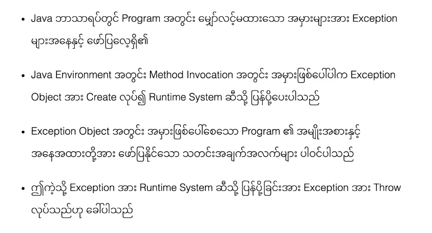
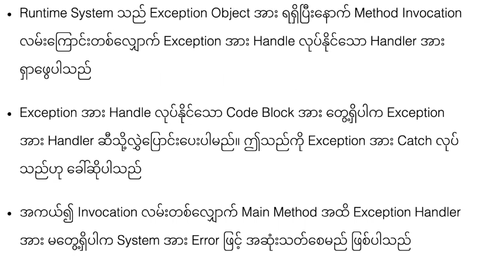
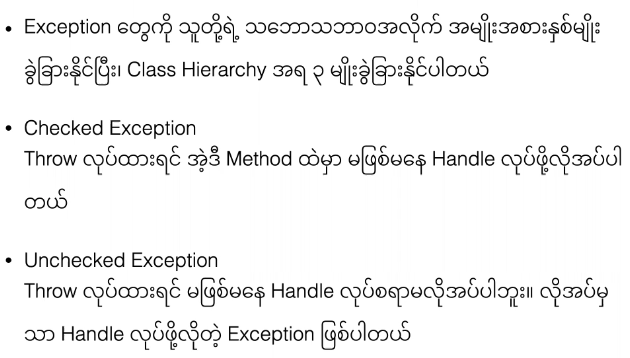
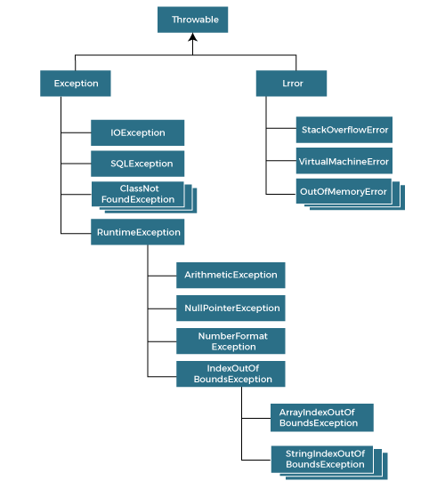

## Exception

### What is Exception




### Call Stack and Exception

- **` အောက်ပါ code တွင်  main မှ method1, method1 မှ method 2, method 3 မှ , method 4 ကိုခေါ်ထားပါသည် ၍သို့ အဆင့်ဆင့် ခေါ်ထားခြင်းကို Call Stack ဟုခေါ်ပါတယ် `**

- **`Method 4 တွင် Exception တစ်ခုဖြစ်နေပြီး ထို Exception အား Handlers လုပ်န်ိင်သော Exception Handlers အား Call Stack  တစ်လျှောက်လိုက်ရှာ သည် အကယ်၍ Exception Handlers မတွေ့ပါက Program ရပ်သွားပြီး Exception ဖြစ်ပေါ်သော နေရာ နောက် က Code တွေသည် အလုပ်မလုပ်တော့ပါ `**

- **`Exception ဖြစ်ပေမဲ့  Call Stack  တစ်လျှောက် Exception Handlers ရှိပါက ထို Exception Handlers လုပ်လုပ်ပြီး Exception ဖြစ်ပေါ်သော နေရာ နောက် က Code တွေလည်း Progrom ပျက်မသွားပဲ အလုပ်လုပ်ပါမည်`**

  ```java
  class TestException{
  	public static void main(String[] args){
          System.out.println("Start Main Class");
  		method1();
          System.out.println("End Main Class");
  	}
  	static void method1(){
  		System.out.println("Method1");
          method2();
  	}
  	static void method2(){
          System.out.println("Method2");
          try{
             method3();
          }catch(ArithmeticException e){
              System.out.println("Error ? Exception Handlers in method 2  ");
          }
  	}
      static void method3(){
          System.out.println("Method3");
          method4();
  	}
      static void method4(){
  		System.out.println("Method4");
          int res = 12/0;
  	}
  }
  
  //Without Exception Handlers
  ava TestException.java
  Start Main Class
  Method1
  Method2
  Method3
  Method4
  Exception in thread "main" java.lang.ArithmeticException: / by zero
  	at TestException.method4(TestException.java:22)
  	at TestException.method3(TestException.java:17)
  	at TestException.method2(TestException.java:13)
  	at TestException.method1(TestException.java:9)
  	at TestException.main(TestException.java:4)
  
  //With Exception Handlers
  > java TestException.java
  Start Main Class
  Method1
  Method2
  Method3
  Method4
  Error ? Exception Handlers in method2  
  End Main Class
  ```




### Types of Java Exceptions

> There are mainly two types of exceptions: checked and unchecked. An error is considered as the unchecked exception. However, according to Oracle, there are three types of exceptions namely:

- **`Checked Exception`** : `The classes that directly inherit the Throwable class except RuntimeException and Error are known as checked exceptions. For example, IOException, SQLException, etc.` **`Checked exceptions are checked at compile-time.`**

- **`Unchecked Exception`** : `The classes that inherit the RuntimeException are known as unchecked exceptions. For example, ArithmeticException, NullPointerException, ArrayIndexOutOfBoundsException, etc.` **`Unchecked exceptions are not checked at compile-time, but they are checked at runtime.`**

- **`Error`** :  `Error is irrecoverable. Some example of errors are` **`OutOfMemoryError, VirtualMachineError, AssertionError etc.`**

  >  **` အောက်ပါ code တွင်  Handlers နှစ်ခုရှိပေမဲ့ အပေါ်က Handlers ကို အလုပ်မလုပ်ပါ ဘာကြောင့် လည်းဆိုတော့ Exception တတ်တဲ့အမျိုးအစားမတူလို့ပါ။ တတ်တဲ့ Exception က Error အမျိူးအစားဖြစ်နေပြီး ဖမ်းတဲ့ Handlers က  ArithmeticException Handlers ဖြစ်နေလို့ပါ ဒါကြောင့် Error Handlers ကသာ အလုပ်လု်ပါသည်`**

  ```java
  public class ErrorDemo{
      public static void main(String[] args){
          try{
              makeError(0);
          }catch(ArithmeticException e){
              System.out.println("Exception");
          }
          catch(Error r){
              System.out.println("Error");
          }
      }
      static void makeError(int count){
          System.out.println("Count is "+ ++count);
          makeError(count);
      }
  }
  ```

  




### Hierarchy of Java Exception classes

- **`The java.lang.Throwable class is the root class of Java Exception hierarchy inherited by two subclasses: Exception and Error.`**



