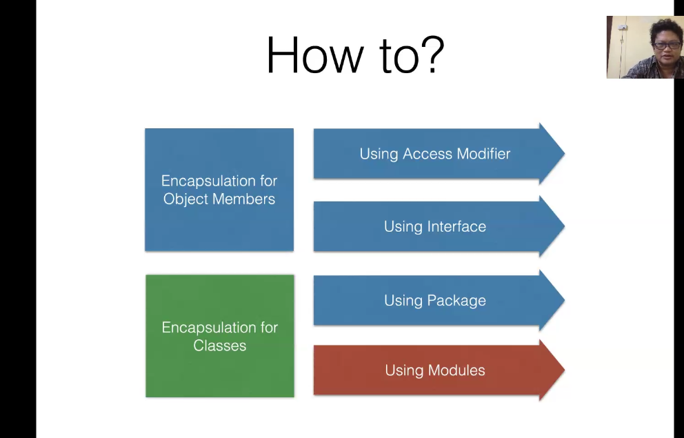
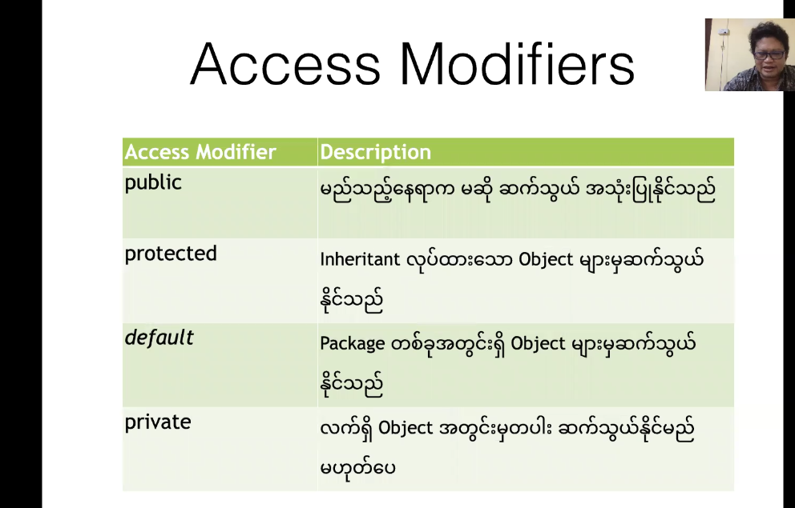
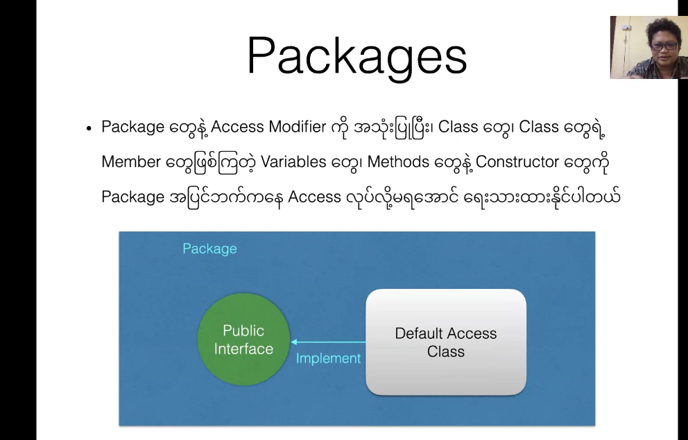

 ### Encapsulation

#### What is

#### How To

#### Implement with Access Modifier

#### Implement with Interface

#### Implement with Package

### Well Encapsulated Class

### Because of Encapsulation

