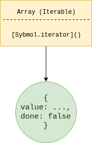
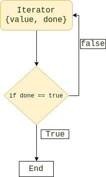

##  Iterators

- `There are many ways to loop through a data structure(Collection) in JavaScript. For example, using a *for* loop or using a *while* loop. `

- `An Iterator has similar functionality but with a significant difference.`

- `Iterators allow you to iterate over an object (arrays are also objects).`

- `The iterator protocol defines how to produce a sequence of values from an object.`

- `An object becomes an iterator when it implements a next() method.The next() method must return an object with two properties`
  
    - `value (the next value)`
    
    - `done (true or false)`
    
- `An iterator only needs to know the current position in the collection as opposed to other loops where they require to load the entire collection upfront in order to loop through it.`

- :warning: `Practically not possible to create consumers for all data sources like plain object, that’s the reason ES6 introduces Interface Iterable.`

  


#### Iterable values

- `An Iterable values can be iterated over with the code: *for loop* or *for..of loop*`.
- `If you have used for...of loop .You have actually been using iterators `
- `A JavaScript iterable has a Symbol.iterator`.
- `The *Symbol.iterator* is a function that returns a *next()* function.`
- `The following values are iterable:`
  - `Arrays`
  - `Strings`
  - `Maps`
  - `Sets`


> :warning: `Plain objects are not iterable.`


​	


#### Iterators in Array, Map, Set, String

- String, Array, Typed Array, Map and Set are all built-in iterables because each of their prototype objects implements an @@iterator method.

  ```js
  let ar = [];
  console.log(ar) //Symbol(Symbol.iterator)
  
  let m = new Map();
  console.log(ar) //Symbol(Symbol.iterator)
  
  let s = new Set()
  console.log(s) //Symbol(Symbol.iterator)
  
  let str = new String()
  console.log(str) //Symbol(Symbol.iterator)
  ```

  


#### Normal Looping

```js
const favourtieMovies = [
  'Harry Potter',
  'Lord of the Rings',
  'Rush Hour', 
  'Interstellar',
  'Evolution',
];

// For loo
for (let i=0; i < favouriteMovies.length; i++) {
  console.log(favouriteMovies[i]);
}

// While loop
let i = 0;
while (i < favourtieMovies.length) {
  console.log(favourtieMovies[i]);
  i++;
}
```


####  Looping with Built-in Iterator iterators

- `We have some build-in iterator available e.g. Map, Set, String, Array, Typed Array; these all are already available, because their prototype objects implement the @@iterator method(interface).`

- ` But they will follow the default iteration behavior`

  ```js
  const favourtieMovies = [
    'Harry Potter',
    'Lord of the Rings',
    'Rush Hour', 
    'Interstellar',
    'Evolution',
  ];
  
  const iterator = favourtieMovies[Symbol.iterator]();
   
  iterator.next();  //{ value: 'Harry Potter', done: false }
  iterator.next();  //{ value: 'Lord of the Rings', done: false }
  iterator.next();  //{ value: 'Rush Hour', done: false }
  iterator.next();  //{ value: 'Interstellar', done: false }
  iterator.next();  //{ value: 'Evolution', done: false }
  iterator.next();  //{ value: undefined, done: true }
  
  ```

  


#### Looping with Custom Iterable

- :warning: `Practically not possible to create consumers for all data sources like plain object, t`

- :warning: `Plain objects are not iterable.But with iterator you can do it   .That’s the reason ES6 introduces Interface Iterable.`

- `We can define custom iterator using [Symbol.iterator].`

  ```js
  const favouriteMovies = {
    a: 'Harry Potter',
    b: 'Lord of the Rings',
    c: 'Rush Hour',
    d: 'Evolution',
    e: 'Interstellar',
  }
  favouriteMovies[Symbol.iterator] = function() {
    const ordered = Object.values(this).sort((a, b) => a - b);
    let i = 0;
    return {
      next: () => ({
        done: i >= ordered.length,
        value: ordered[i++]
      })
    }
  }
  
  for (const v of favouriteMovies) {
    console.log(v);
  }
  ```

  


