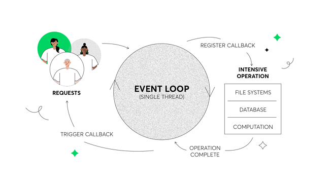

##                                                                    Intro 


#### How work webserver 

> `A common task for a web server can be to open a file on the server and return the content to the client`


- `In  PHP or ASP handles a file request:`

  - `Sends the task to the computer's file system.`

  - `Waits while the file system opens and reads the file.`

  - `Returns the content to the client.`

  - `Ready to handle the next request.`

- `In Nodejs`

  - `Sends the task to the computer's file system.`

  - `Ready to handle the next request.`

  - `When the file system has opened and read the file, the server returns the content to the client.`

    >  `Node.js eliminates the waiting, and simply continues with the next request.`

  


# Node

-  `Open source runtime environment(top of V8 Js engine) & running on server(running outside  browser)`

- ` Non-blocking I/O model`

- `Single-threaded(to service all requests`)`

- `Event-driven `

- `Asynchronously programming`

- `Easy & fast & scalable very memory efficient and real time web applications`

  

#### Advantage 

- `Fast,efficient and sclabale `
- `Event driven,Non-blocking I/O model`
- `Javascript`


#### Non-blocking I/O (Asynchronous)

- `"I/O" refers primarily to interaction with the system's disk and network supported by libuv.`

- `A blocking or non-blocking operating model is a process that deals with input/output operations.`

- `Process is reading from a source or writing to a resource such as file open or database or network requests.On the other hand, the random-access memory (RAM) can be addressed quickly and doesn’t require waiting. So accessing memory is not considered as an I/O operation. `

- `A non-blocking operation in Node js does not wait for I/O to complete( doesn't block execution).`

- `Blocking refers to operations that block further execution until that operation finishes.`

- `One advantage of non-blocking, asynchronous operations is that you can maximize the usage of a single CPU as well as memory.`

- [See More](https://ecommerce-consultant.medium.com/blocking-and-non-blocking-operations-in-nodejs-c30d5208e50) [see more](https://afteracademy.com/blog/blocking-and-non-blocking-in-node-js-asynchronous-operations-and-callbacks)

  ```js
  // reads a file in a asynchronous and non-blocking way
  const fs = require('fs');
  // task one
  fs.readFile('big.txt',(err,data)=>{
      console.log(data)
  })
  // task two
  console.log('work')
  
  // reads a file in a synchronous and blocking way
  const fs = require('fs');
  const data = fs.readFileSync('big.txt');
  console.log(data);
  console.log('work')
  ```

  


#### [Event Loop](https://nodejs.org/en/docs/guides/event-loop-timers-and-nexttick/)

- `The` **event loop** `is the primary component that allows Node.js to run (otherwise) blocking I/O operations in a non-blocking way.`

- `EventEmitter class is used to bind event and event listeners`

  

  


#### Multi-Threaded Model 

> `In multi-threaded processing setups, each server has a limited thread pool at it’s disposal. Every time the server receives a request from the client, it picks a thread from the pool and assigns it to the client’s request. This thread will take care of all the processing related to that request. Inside these threads, the processing is sequential and synchronous in nature i.e. one operation is performed at a time. Regardless, when a new concurrent request is made to the server, it can pick up any available thread from the pool and put it on duty. `
>
> `This can go on and on until all your threads are exhausted. When that happens, your server is forced to wait for at least one of the busy threads to be freed for the new request(s) to be catered to. If not responsibly accounted for, this can turn out to be slow and inefficient for your application. Besides, the synchronous nature of processing inside each thread means that even though we can spin up multiple threads for concurrent requests, each thread, individually, will be slowed down when encountered by blocking code. Such multi-threaded support also brings forth the difficulties of dealing with synchronizing and managing multiple threads. There’s also a risk of dead-locking, wherein multiple threads are blocked forever in the process of waiting for each other to free up resources.`
>
> 


#### Single-Threaded Model


#### What can we build with nodes 

- `NodeOS`
- `Internet of Thing`
- `Responsive Real-time applications`
- `Node Games`
- `Creation of Drawing Apps`
- `Cross-platform Desktop Apps`
- `Complex Single-Page Applications`
- `Streaming apps`
- `Command Line Interface`
- `Microservices `
- `Anything you want with more features than you can imagine`
- [see mor](https://medium.com/@django.course/6-cool-out-of-the-box-things-you-can-build-using-node-js-9c89ac976602)


#### Popular  Modules(3rd Party)

- `Express: Fast, unopinionated, minimalist web framewor(npm install express)`   
- `Socket.io : enables real-time bidirectional event-based communication(npm install socket.io )`
- `Gulp :  task runner that lets developers automate many development tasks(npm install --save gulp-install)`
- `Grunt:Task Runner(npm install grunt)`
- `Commander.js : creating command-line interfaces without any fuss.(npm install commander) `
- `Async : is a utility module which provides straight-forward, powerful functions for working with asynchronous JavaScript (npm i async).`
- `Browserify :  to use Node.js modules directly in the browse(npm install -g browserify)`
- `Moment: helps you manage dates(npm install moment --save)`
- `Lodash :  provides utility functions for common programming tasks using the functional programming paradigm(npm i --save lodash)`
- `Cheerio : help us to extract relevant data from an HTML string(npm install cheerio)`
- `Nodemailer :  to send emails from(npm i nodemailers)`
- `Hapi  : open-source framework for web applications to build web services such as JSON API.(npm install @hapi/hapi)`
- `PM2 : the framework to use for scaling large application() `
- `Bower`
- `Underscore`
- `UglifyJS2`
- `Passport :`


#### Client-Server Architecture
#### Uber Old and New  Architecture
####  Success Stories
####  Node.js Trend 
####  Node.js Features 


https://scoutapm.com/blog/nodejs-architecture-and-12-best-practices-for-nodejs-development

https://scoutapm.com/blog/nodejs-architecture-and-12-best-practices-for-nodejs-development#abriefhistory


### For papar noute

```js
/* Nodejs
  -  Browser မှာ Rendering Engine, JavaScript Engine နဲ့ UI တို့ ပေါင်းစပ်ပါဝင်ပါတယ် 
  - Rendering Engine ရဲ့ တာဝန်ကတော့ HTML, CSS တွေပေါ်မှာ အခြေခံပြီး သင့်တော်တဲ့ အသွင်အပြင် တွေကိုဖော်ပြပေးဖို့ဖြစ်တယ်။
    HTML Element တွေကို ဖော်ပြပေးနေတာ ၊ SS Style သတ်မှတ်ချက်တွေအတိုင်း ဖော်ပြပေးနေတာ Rendering Engine ပါ။ 
    Apple Safari Browser က Webkit ၊ Mozilla Firefox က Gecko ၊ Opera Browser ကတော့ Presto စသဖြင့်
    ထင်ရှားတဲ့ Rendering Engine တွေရှိကြပါတယ်။ Rendering Engine တွေထဲမှာ Webkit က အထင်ရှားဆုံးပါ။ KHTML-> Webkit -> Blink
  - UI ကတော့ Browser Menu တွေ၊ Toolbar တွေ၊ URL Bar, Bookmark, History, Download စတဲ့ User တွေမြင်တွေ့ထိပြီး အသုံးပြုတဲ့ အရာတွေပါ။ 
  - JavaScript Engine ရဲ့တာဝန်ကတော့ JavaScript Code တွေကို Run ပေးခြင်းပဲ ဖြစ်ပါတယ်။ Google က Chromium ကို ထွင်တဲ့အခါ
    Rendering Engine အနေနဲ့ Webkit ကို ယူသုံးခဲ့ပေမယ့် JavaScript Engine ကိုတော့ သူဘာသာ အသစ် ထွင်ပြီး ထည့်ခဲ့ပါတယ်။ အဲ့ဒီ Engine ကို V8 	လို့ပါတယ်။ တခြား JavaScript Engine တွေနဲ့ယှဉ်ရင် သိသိ သာသာ ပိုမြန်တဲ့ Engine တစ်ခုရယ်လို့ ထင်ရှားပါတယ်။  
 - အရင်က JavaScript ဆိုတာ Browser ထဲမှာပဲ Run တဲ့ နည်းပညာပါ။ အခုတော့ Browser ရဲ့ ပြင်ပမှာ Node ကိုအသုံးပြုပြီးတော့ JavaScript Code တွေကို 	  Run လို့ ရသွားပါပြီ ။ JavaScript ဟာလည်း Client-side Language ဆိုတဲ့အဆင့်ကနေကျော်ပြီး၊ ကြိုက်တဲ့နေရာမှာသုံးလို့ရတဲ့ Language တစ်ခုရယ်လို့ ဖြစ်       လာပြီး server-side Code တွေ ၊ Desktop Solution တွေ ၊ Raspberry Pi ၊ Arduino တွေပေါ်  JavaScript ကို အသုံးပြုလို့ရပါပြီ
 - ဒါကြောင့် Node ဆိုတာ JavaScript Run-Time နည်း ပညာဖြစ်ပါတယ်။ Node ဆိုတာ JavaScript မဟုတ်ပါဘူး။ Node ဆိုတာ JavaScript ကုဒ်တွေကို 	 Runပေးနိုင်တဲ့ နည်းပညာပါ။
*/
/* Why 
  - Node ရဲ့ ထူးခြားချက်ကတော့ Non-blocking I/O လို့ခေါ်တဲ့ နည်းစနစ်ကို အသုံးပြုခြင်းပါ။
  - ကွန်ပျူတာရဲ့ Processor ဟာ တစ်စက္ကန့်မှာ Instruction ပေါင်း သန်းနဲ့ချီပြီး အလုပ်လုပ်ပေးနိုင်ပါတယ်။ ဒါပေမယ့် Hard Disk ပေါ်က အချက်အလက်			တွေRead/Write လုပ်ယူတာလို အလုပ်မျိုး ၊ အင်တာနက် အဆက်အသွယ်ကိုသုံးပြီး အချက်အလက်တွေ ယူရတာမျိုး စသဖြင့် Input /
    Output Device တွေဟာ၊ Processor ရဲ့ အလုပ်လုပ်နိုင်စွမ်းနဲ့ နှိုင်းယှဉ်ကြည့်ရင် တော်တော် နှေးကြပါတယ်။ 
  - ရိုးရိုးပရိုပရမ်တွေမှာ Process က မြန်ချင်ပေမယ့် မြန်လို့မရzဲ I/O ကို ပြန်စောင့်နေရတာတွေ ရှိ ကြပါတယ်။ Node ကတော့ Asynchronous ရေးဟန်နဲ့အတူ     	  Process က I/O ကို စောင့်စရာအောင် တီထွင်ထားပါတယ်။
  - အောက်ကကုဒ်မှာ ရေးထားတဲ့ အစီအစဉ်အရ Some processes ဆိုတဲ့စာတစ်ကြောင်းကို အရင်ရိုက်ထုတ်မယ်။ ပြီး ရင် data.txt ကို oတ်ပြီး အထဲက Content ကို     ရိုက်ထုတ်မယ်။ ပြီးရင် Some more processes ဆိုတဲ့စာတစ်ကြောင်းကို ဆက်ပြီးရိုက်ထုတ်မယ်။ ဒီလိုရေးထားတာပါ။ ဒါပေမယ့် Node ရဲ့ Non-blocking I/Oသဘော  	  သသာဝက data.txt ကို oတ်လို့ပြီးအောင် မစောင့်ပဲ လုပ်စရာရှိတာ ဆက်လုပ်သွားမှာပါ။
  - Node ရဲ့ Non-blocking I/O ကြောင့် File ကိုဖတ်ယူတဲ့ I/O ကို စောင့်စရာမလိုပဲ ကျန်တဲ့ Process တွေက ဆက်အလုပ်လုပ်သွားတာပါ။ ဖိုင်ကို ဖတ်လို့
    ပြီးတော့မှသာ ပေးလိုက်တဲ့ Callback Function က အလုပ်လုပ်သွားမှာပါ။ 
*/
const fs = require("fs");
console.log("Some processes...");
fs.readFile("data.txt", "utf-8", (err, data) => console.log(data));
console.log("Some more processes...");
Some processes…
Some more processes…
>> data entries…


/* How work webserver 
   - A common task for a web server can be to open a file on the server and return the content to the client`
*/ 

/* Different Between PHP or ASP and Nodejs
- In  PHP or ASP handles a file request
  - Sends the task to the computer's file system.
  - Waits while the file system opens and reads the file.
  - Returns the content to the client.
  - Ready to handle the next request.
- In Nodejs
  	- Sends the task to the computer's file system.
  	- Ready to handle the next request
  	- When the file system has opened and read the file, the server returns the content to the client.(Node.js 		 eliminates the waiting, and simply continues with the next request)
*/


/* Summery 
	- Open source runtime environment(top of V8 Js engine) & running on server(running outside  browser)
	- Non-blocking I/O model
	- Single-threaded(to service all requests`)
	- Event-driven 
	- Asynchronously programming
	- Easy & fast & scalable very memory efficient and real time web applications
*/
```

