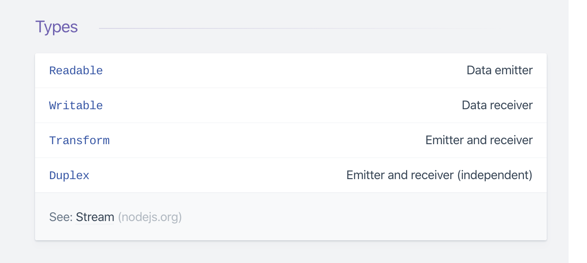

## Streams, Buffer and PIpe


>  in a Node.js based HTTP server, `request` is a readable stream and `response` is a writable stream.


#### Streams

- `Streams are one of the fundamental concepts that power Node.js applications. They are data-handling method and are used to read or write input into output sequentially.`

- `Streams are a way to handle reading/writing files, network communications, or any kind of end-to-end information exchange in an efficient way or  sequence of data being moved from one point to the other over time.`

- `is that instead of a program reading a file into memory **all at once** like in the traditional way, streams read chunks of data piece by piece, processing its content without keeping it all in memory.`

- `This makes streams really powerful when working with **large amounts of data**, for example, a file size can be larger than your free memory space, making it impossible to read the whole file into the memory in order to process it. That’s where streams come to the rescue!`

- `Using streams to process smaller chunks of data, makes it possible to read larger files.`

- `Let’s take a “streaming” services such as YouTube or Netflix for example: these services don’t make you download the video and audio feed all at once. Instead, your browser receives the video as a continuous flow of chunks, allowing the recipients to start watching and/or listening almost immediately.`

- `A stream is an abstract interface for working with streaming data in Node.js. `

- `Streams can be readable, writable, or both. `

- `All streams are instances of  EventEmitter`

  ```js
  // Stream
  [ <Buffer 20 76 69 74 61 65 2c 2... >
    <Buffer 20 76 69 74 61 65 2c 2... >
    <Buffer 20 76 69 74 61 65 2c 2... > 
  ]
  20 76 69 74 61 65 2c 2 are chunks
  Streams -> Buffer -> chunks
  ```

  


#### Why streams

- `Memory efficiency: you don’t need to load large amounts of data in memory before you are able to process it`

- `Time efficiency: it takes significantly less time to start processing data as soon as you have it, rather than having to wait with processing until the entire payload has been transmitted`

  


#### There are 4 types of streams in Node.js:

1. `Writable: streams to which we can write data. For example, fs.createWriteStream() lets us write data to a file using streams.`

2. `Readable: streams from which data can be read. For example: fs.createReadStream() lets us read the contents of a file.`

3. `Duplex: streams that are both Readable and Writable. For example, net.Socket`

4. `Transform: streams that can modify or transform the data as it is written and read. For example, in the instance of file-compression, you can write compressed data and read decompressed data to and from a fil`

   

 


#### Buffers 

 - `A buffer is a temporary  raw binary data;`

 - `The Buffer class in Node. js is designed to handle raw binary data;`

 - `more efficient for lager amout of data`

  - `No need to wait for the entire resource to load`

    ```js
    //buffer
    <Buffer 20 76 69 74 61 65 2c 20 65 67 65 73 74 61 73 20 69 64 20 73 65 6d 2e 20 44 6f 6e 65 63 20 75 74 20 75 6c 74 72 69 63 69 65 73 20 6c 6f 72 65 6d 2c 20 ... >
    ```

    


#### Pipe 

- `The 'pipe' event is emitted when the stream.pipe() method is called on a readable stream`
- `With stream piping, the code size is reduced to only one line of code.`
- `fast than manually stream(readable stream to writeable stream) `


######       Reading the file into the memory using the `.readFile()` method and sends it to the user.

```js
const http = require('http');
const fs = require('fs');

const server = http.createServer((req, res) => {
     fs.readFile('vid.mp4', (err, data) => {
        if (err) throw err;

        res.end(data);
    });
});

server.listen(8080);
```


###### Reading the file into the memory using the `.createReadStream() and pipe()` method and sends it to the user.

```js
const http = require('http');
const fs = require('fs');

const server = http.createServer((req, res) => {
    const readStream = fs.createReadStream('vid.mp4');
    readStream.pipe(res);
});

server.listen(8080);
```


crd : https://www.freecodecamp.org/news/do-you-want-a-better-understanding-of-buffer-in-node-js-check-this-out-2e29de2968e8/

crd : https://nodesource.com/blog/understanding-streams-in-nodejs/

crd  : https://www.freecodecamp.org/news/node-js-streams-everything-you-need-to-know-c9141306be93/


## For Paper Note

```js
> In a Node.js based HTTP server, `request` is a readable stream and `response` is a writable stream.

/* Streams
 -  Streams are a way to handle reading/writing files, network communications, or any kind of end-to-end 			information exchange in an efficient way.
 - In traditional way a program read a file into memory *all at once*.But streams read chunks of data piece by        piece, processing its content without keeping it all in memory.
 - This makes streams really powerful when working with *large amounts of data*, for example, a file size can be      larger than your free memory space, making it impossible to read the whole file into the memory in order to        process it. That’s where streams come to the rescue!
 - YouTube or Netflix are use Stream for their services.these services don’t make you download the video and audio    feed all at once. Instead, your browser receives the video as a continuous flow of chunks, allowing the            recipients to start watching and/or listening almost immediately.
 - Streams are one of the fundamental concepts that power Node.js applications. They are data-handling method and     are used to read or write input into output sequentially.
 - A stream is an abstract interface for working with streaming data in Node.js. 
 - Streams can be readable, writable, or both.
 - All streams are instances of  EventEmitter
*/

/*Why streams
  - Memory efficiency: you don’t need to load large amounts of data in memory before you are able to process it
  - Time efficiency: it takes significantly less time to start processing data as soon as you have it, rather than 	   having to wait with processing until the entire payload has been transmitted
*/

/* Four types of streams in Node.js 
	1.Writable: streams to which we can write data. For example, fs.createWriteStream() lets us write data to a 				file using streams.
	2.Readable: streams from which data can be read. For example: fs.createReadStream() lets us read the contents 				  of a file.
	3.Duplex: streams that are both Readable and Writable. For example, net.Socket
	4.Transform: streams that can modify or transform the data as it is written and read. For example, in the 					instance of file-compression, you can write compressed data and read decompressed data to and from 				   a file
*/

/* Buffers 
 	- A buffer is a temporary  raw binary data;`
 	- The Buffer class in Node. js is designed to handle raw binary data;`
*/
<Buffer 20 76 69 74 61 65 2c 20 65 67 65 73 74 61 73 20 69 64 20 73 65 6d 2e 20 44 6f 6e 65 63 20 75 74 20 75 6c 74 72 69 63 69 65 73 20 6c 6f 72 65 6d 2c 20 ... >
    
/* Pipe 
	- The 'pipe' event is emitted when the stream.pipe() method is called on a readable stream
	- With stream piping, the code size is reduced to only one line of code.
	- Fast than manually stream(readable stream to writeable stream) 
*/	
add all photos   
   
  
```

