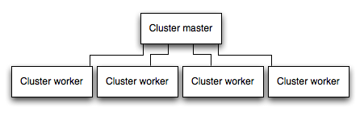

##                                                                                                                 Best Practices

----


### Use gzip compression

- **`Gzip`** `compressing can greatly decrease the size of the response body and hence increase the speed of a web app.`

- `Use the` [compression](https://www.npmjs.com/package/compression) `middleware for` **`Gzip`** `compression in your Express app`

  

  ```javascript
  const compression = require('compression')
  const express = require('express')
  const app = express()
  app.use(compression())
  ```


### Don’t use synchronous functions

- `Node and many modules provide synchronous and asynchronous versions of their functions`
- `A single call to a synchronous function might return in a few microseconds or milliseconds, however in high-traffic websites, these calls add up and reduce the performance of the app. Avoid their use in production.`
- `All your asynchronous code must return promises (except emitters). If a particular library does not return promises, convert the base object by using a helper function like` [Bluebird.promisifyAll()](http://bluebirdjs.com/docs/api/promise.promisifyall.html).


### Do logging correctly

- `In general, there are two reasons for logging from your app: For` **`debugging`** and for **`logging app activity`**

- `Using `**`console.log()`** `or` **`console.error()`** `to print log messages to the terminal is common practice in development. But` [these functions are synchronous](https://nodejs.org/api/console.html#console_console_1) `so they are not suitable for production`

- **`For debugging`**

  - `If you’re logging for purposes of debuggin.` `Then instead of using `**`console.log()`**, `use a special debugging module like` [debug](https://www.npmjs.com/package/debug). 

- **`For app activity`**

  - `If you’re logging app activity (for example, tracking traffic or API calls), instead of using `**`console.log()`**, `use a logging library like` [Winston](https://www.npmjs.com/package/winston) `or` [Bunyan](https://www.npmjs.com/package/bunyan).

  

  


### Handle exceptions properly

- ` Not handling exceptions and taking appropriate actions will make your Express app crash and go offline.`

- `If you handle exceptions,that`  [Ensure your app automatically restarts](https://expressjs.com/en/advanced/best-practice-performance.html#ensure-your-app-automatically-restarts) `below, then your app will recover from a crash.`

- `To ensure you handle all exceptions,you can use` [Use try-catch](https://expressjs.com/en/advanced/best-practice-performance.html#use-try-catch) `and` [Use promises](https://expressjs.com/en/advanced/best-practice-performance.html#use-promises) `(Promises will handle any exceptions (both explicit and implicit) `.`For more information about error-handling by using promises, see `[Promises in Node.js with Q – An Alternative to Callbacks](https://strongloop.com/strongblog/promises-in-node-js-with-q-an-alternative-to-callbacks/).

  

  **`Note`** : `Event emitters (like streams) can still cause uncaught exceptions. So make sure you are handling the error event properly.`
  
  
  
  
  


### Set NODE_ENV to “production”

- `Setting` **`NODE_ENV`** `is so important for performance (and easy to do)`

- **`NODE_ENV`**  `environment variable specifies the environment in which an application is running.`

- `Setting` **`NODE_ENV `** `to` **`production`** `makes` **`Express`**: **`Cache view templates ,`** **`Cache CSS files generated from CSS extensions ,`** **`Generate less verbose error messages.`**

- `If you need to write environment-specific code, you can check the value of` **`NODE_ENV`** `with` **`process.env.NODE_ENV`**

- `In development, you typically set environment variables in your interactive shell, for example by using export or your `**`.bash_profile` ** `file. But in general you shouldn’t do that on a production server; instead, use your ` **`OS’s init system (systemd or Upstart)`**.`For more information, see the` [Upstart Intro, Cookbook and Best Practices](http://upstart.ubuntu.com/cookbook/#environment-variables).

  ```js
  /* With systemd, use the Environment directive in your unit file.
   * etc/systemd/system/myservice.service
  */
  Environment=NODE_ENV=production
  
  /* With Upstart,
   * etc/init/env.conf
  */
 env NODE_ENV=production
  ```
  
  


### Ensure your app automatically restarts

> *`In production, if you don’t want your application to be offline, ever. Make sure it restarts both if the app crashes and if the server itself crashes`*
>
> *`Node applications can crash if they encounter an uncaught exception.So you need to do is to ensure your app is well-tested and handles all exceptions`* (see [handle exceptions properly](https://expressjs.com/en/advanced/best-practice-performance.html#handle-exceptions-properly) for details).

- `Use` **`process manager`** `for restart the app (and Node) when it crashes.`
- `Using the` **`init system`**` provided by your` **`OS`** `to restart the process manager when the` **`OS crashes`**. `It’s also possible to use the init system without a process manager.`


#### Use a process manager for restart the app

- `A process manager is a` **`container`** `for applications that facilitates deployment, provides high availability, and enables you to manage the application at runtime.`
-  `A process manager can enable you to:`
  - `Gain insights into runtime performance and resource consumption.`
  - `Modify settings dynamically to improve performance.`
  - `Control clustering (StrongLoop PM and pm2).`
- `The most popular process managers for Node are as follows:`
  - [StrongLoop Process Manager](http://strong-pm.io/)
  - [PM2](https://github.com/Unitech/pm2)
  - [Forever](https://www.npmjs.com/package/forever)
- `For a more detailed introduction to all three, see `[Process managers for Express apps](https://expressjs.com/en/advanced/pm.html).


#### Use an init system for restart the app

- `The next layer of reliability is to ensure that your app restarts when the server restarts. `
- `To ensure that your app restarts if the server crashes, use the init system built into your OS. `
- `The two main init systems in use today are` [systemd](https://wiki.debian.org/systemd) `and `[Upstart](http://upstart.ubuntu.com/).
- `There are two ways to use init systems with your Express app:`
  - `Run your app in a process manager, and install the process manager as a service with the init system.`
  - `The process manager will restart your app when the app crashes, and the init system will restart the process manager when the OS restarts. This is the recommended approach.`
  - `Run your app (and Node) directly with the init system. This is somewhat simpler, but you don’t get the additional advantages of using a process manager.`


##### Systemd

- **`Systemd`** `is a `**`Linux system and service manager`**.`(Most major Linux distributions have adopted systemd as their default init system)`

- `A systemd service configuration file is called a` **`unit file`**, `with a filename ending in` **`.service`**.

- `For more information on systemd, see the` [systemd reference (man page)](http://www.freedesktop.org/software/systemd/man/systemd.unit.html).

- `Here’s an example unit file to manage a Node app directly. Replace the values enclosed in `<angle brackets>` for your system and app:`

  
  
  ```shell
  [Unit]
  Description=<Awesome Express App>
  
  [Service]
  Type=simple
  ExecStart=/usr/local/bin/node </projects/myapp/index.js>
  WorkingDirectory=</projects/myapp>
  
  User=nobody
  Group=nogroup
  
  # Environment variables:
  Environment=NODE_ENV=production
  
  # Allow many incoming connections
  LimitNOFILE=infinity
  
  # Allow core dumps for debugging
  LimitCORE=infinity
  
  StandardInput=null
  StandardOutput=syslog
  StandardError=syslog
  Restart=always
  
  [Install]
WantedBy=multi-user.target
  ```
  
  

###### StrongLoop PM as a systemd service

- `You can easily install StrongLoop Process Manager as a systemd service. After you do, when the server restarts, it will automatically restart StrongLoop PM, which will then restart all the apps it is managing.`

  
  
  ```js
  // To install StrongLoop PM as a systemd service:
  $ sudo sl-pm-install --systemd 
  // Then start the service with
$ sudo /usr/bin/systemctl start strong-pm 
  ```
  
  

##### Upstart

- **`Upstart`** `is a system tool available on many Linux distributions for starting tasks and services during system startup.`

- `You can configure your Express app or process manager as a service and then Upstart will automatically restart it when it crashes.`

- `An Upstart service is defined in a` **`job`** `configuration file (also called a “job”) with filename ending in `.**`conf`.**

- `The following example shows how to create a job called “myapp” for an app named “myapp” with the main file located at ` *`/projects/myapp/index.js`*.

- `Create a file named ` *`myapp.conf`* at *`/etc/init/`* `with the following content (replace the bold text with values for your system and app)`

  
  
  ```shell
  
  # When to start the process
  start on runlevel [2345]
  
  # When to stop the process
  stop on runlevel [016]
  
  # Increase file descriptor limit to be able to handle more requests
  limit nofile 50000 50000
  
  # Use production mode
  env NODE_ENV=production
  
  # Run as www-data
  setuid www-data
  setgid www-data
  
  # Run from inside the app dir
  chdir /projects/myapp
  
  # The process to start
  exec /usr/local/bin/node /projects/myapp/index.js
  
  # Restart the process if it is down
  respawn
  
  # Limit restart attempt to 10 times within 10 seconds
respawn limit 10 10
  ```
  
  > `Since the job is configured to run when the system starts, your app will be started along with the operating system, and automatically restarted if the app crashes or the system goes down.`
  >
  > `Apart from automatically restarting the app, Upstart enables you to use these commands:`
  >
  > - `start myapp` – Start the app
  > - `restart myapp` – Restart the app
  > - `stop myapp` – Stop the app.
  >
  > For more information on Upstart, see [Upstart Intro, Cookbook and Best Practises](http://upstart.ubuntu.com/cookbook).


##### StrongLoop PM as an Upstart service

- `You can easily install StrongLoop Process Manager as an Upstart service. After you do, when the server restarts, it will automatically restart StrongLoop PM, which will then restart all the apps it is managing.`

- `NOTE: On systems that don’t support Upstart 1.4, the commands are slightly different. See` [Setting up a production host (StrongLoop documentation)](https://docs.strongloop.com/display/SLC/Setting+up+a+production+host#Settingupaproductionhost-RHELLinux5and6,Ubuntu10.04-.10,11.04-.10) `for more information.`

  

  ```shell
  To install StrongLoop PM as an Upstart 1.4 service:
  $ sudo sl-pm-install
  Then run the service with:
  $ sudo /sbin/initctl start strong-pm
  ```

  


### Run your app in a cluster

- `In a multi-core system, you can increase the performance of a Node app by many times by launching a cluster of processes`.

-  `A cluster runs multiple instances of the app, ideally one instance on each CPU core, thereby distributing the load and tasks among the instances.`

-  `In clustered apps, worker processes can crash individually without affecting the rest of the processes. Apart from performance advantages, failure isolation is another reason to run a cluster of app processes. Whenever a worker process crashes, always make sure to log the event and spawn a new process using` **` cluster.fork().`**

- ⚠️ `Since the app instances run as separate processes, they do not share the same memory space. That is, objects are local to each instance of the app. Therefore, you cannot maintain state in the application code. However, you can use an in-memory datastore like` [Redis](http://redis.io/) `to store session-related data and state. `

  

  


### Cache request results

- `To improve the performance in production is to cache the result of requests, so that your app does not repeat the operation to serve the same request repeatedly.`
- `Use a caching server like` [Varnish](https://www.varnish-cache.org/) `or` [Nginx](https://www.nginx.com/resources/wiki/start/topics/examples/reverseproxycachingexample/) (`see also` [Nginx Caching](https://serversforhackers.com/nginx-caching/))  `to greatly improve the speed and performance of your app`.


### Use a load balancer

- `A single instance can handle only a limited amount of load and traffic.`

- `Setting up a load balancer can improve your app’s performance and speed,`

- `One way to scale an app is to run multiple instances of it and distribute the traffic via a load balancer`.

- `You can easily set up a load balancer for your app by using` [Nginx](http://nginx.org/en/docs/http/load_balancing.html) `or` [HAProxy](https://www.digitalocean.com/community/tutorials/an-introduction-to-haproxy-and-load-balancing-concepts).

- `A load balancer is usually a reverse proxy, that orchestrates traffic to and from multiple application instances and servers. `

  **`Warning`** : `With load balancing, you might have to ensure that requests that are associated with a particular session ID connect to the process that originated them. This is known as` **`session affinity, or sticky sessions`**, `and may be addressed by the suggestion above to` **`use a data store such as Redis for session data (depending on your application)`**.` For a discussion, see` [Using multiple nodes](http://socket.io/docs/using-multiple-nodes/).


### Use a reverse proxy 


- `A reverse proxy sits in front of a web app and performs supporting operations on the requests, apart from directing requests to the app. It can handle error pages, compression, caching, serving files, and load balancing among other things.`
- `Handing over tasks that do not require knowledge of application state to a reverse proxy frees up Express to perform specialized application tasks. For this reason, it is recommended to run Express behind a reverse proxy like `[Nginx](https://www.nginx.com/) or [HAProxy](http://www.haproxy.org/) in production.

 


### Use app generator 

- `The create-react-app`  `is an officially supported way to create React applications.`

  


### Directory Structure for a website.

- `Express does not have a community defined structure for creating applications.`

  ```js
  express-app/
     node_modules/
     config/
        db.js                //Database connection and configuration
        credentials.js       //Passwords/API keys for external services used by your app
        config.js            //Other environment variables
     models/                 //For mongoose schemas
        users.js
        things.js
     routes/                 //All routes for different entities in different files 
        users.js
        things.js
     views/
        index.pug
        404.pug
          ...
     public/                 //All static content being served
        images/
        css/
        javascript/
     app.js
     routes.js               //Require all routes in this and then require this file in 
     app.js 
     package.json
  ```

  


### Directory Structure for RESTful APIs

- `APIs are simpler to design; they don't need a public or a views directory. Use the following structure to build APIs −`

```js
express-app/
   node_modules/
   config/
      db.js                //Database connection and configuration
      credentials.js       //Passwords/API keys for external services used by your app
   models/                 //For mongoose schemas
      users.js
      things.js
   routes/                 //All routes for different entities in different files 
      users.js
      things.js
   routes.js               //Require all routes in this and then require this file in 
   app.js 
   package.json
```


### Follow good generic coding practices

- `DRY (Don’t Repeat Yourself)`
- `Single Responsibility Principle (SRP)`
- `Keep it simple, stupid (KISS)`
- `Separation of Concerns`
- `YAGNI (You ain’t gonna need it)`
- `Avoid premature optimization`
- `S.O.L.I.D programming principles`
- `Dependency injection`


### Other Practices

- `Stick with lowercase file names and camelCase variables. If you look at any npm module, its named in lowercase and separated with dashes. Whenever you require these modules, use camelCase.`

- `Don’t push node_modules to your repositories. Instead npm installs everything on development machines.`

- `Use a `**config** `file to store variables`.

- `Group and isolate routes to their own file (Separate your concerns).`

 - `Validate request data with JSON Schema.` ([how you can get it integrated and validating your requests in no time](https://simonplend.com/how-can-you-handle-request-validation-in-your-express-based-api/)!)

 - `Write Asynchronous Code Use promises, async/await syntax.`

- `Enable the full use of` **`async`** `and` **`await`**.([express-async-errors](https://www.npmjs.com/package/express-async-errors) )

- `Send CORS response headers so web pages can call your API.`([How to fix those confusing CORS errors when calling your Express API](https://simonplend.com/how-to-fix-those-confusing-cors-errors-when-calling-your-express-api/))

- `Use an existing format for error responses.` ([How to send consistent error responses from your Express API](https://simonplend.com/how-to-send-consistent-error-responses-from-your-express-api/))

- `Use Third-party solutions (Don’t reinvent the wheel. Don’t be greedy either) like` [Nodemon](https://www.npmjs.com/package/nodemon), [Gulp](https://gulpjs.com/),[Winston](https://github.com/winstonjs/winston), [Agenda](https://github.com/agenda/agenda)  

- `Clean Code, Easy Readability, Use code linters, formatters and style guides and add comments.`

- ` Publisher Subscriber Models `

-  `Use Application Monitoring Tools` [ScoutAPM](https://scoutapm.com/nodejs-monitoring)  


### Useful Resources 

- https://scoutapm.com/blog/nodejs-architecture-and-12-best-practices-for-nodejs-development#abriefhistory

- https://simonplend.com/5-best-practices-for-building-a-modern-api-with-express/

- https://code.tutsplus.com/tutorials/build-a-complete-mvc-website-with-expressjs--net-34168 

- https://www.terlici.com/2014/08/25/best-practices-express-structure.html.

  
  
  