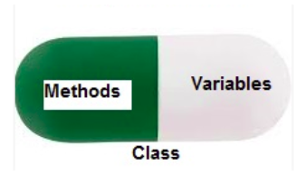

## Encapsulation

- `Encapsulation is one of the fundamental concepts in object-oriented programming (OOP). `

- `Encapsulation in Python is the process of wrapping up properties and methods into a single entity.`

- `In programming, a class is an example that wraps all the properties and methods defined inside it.`

- `When working with classes and dealing with sensitive data, providing global access to all the variables used within the program is not a good choice. `

- `Encapsulation prevents from accessing accidentally, but not intentionally.`

- `To prevent accidental change, an object’s property can only be changed by an object’s method. `

- `An objects property should not always be directly accessible.The methods can ensure the correct values are set. If an incorrect value is set, the method can return an error.`

- `The benefit of using this approach to programming is improved control over the input data and better security.`

  




### Real-life example of encapsulation,

> `Consider a real-life example of encapsulation, in a company, there are different sections like the accounts section, finance section, sales section etc.The finance section handles all the financial transactions and keeps records of all the data related to finance. Similarly, the sales section handles all the sales-related activities and keeps records of all the sales. Now there may arise a situation when for some reason an official from the finance section needs all the data about sales in a particular month. In this case, he is not allowed to directly access the data of the sales section. He will first have to contact some other officer in the sales section and then request him to give the particular data. This is what encapsulation is. Here the data of the sales section and the employees that can manipulate them are wrapped under a single name “sales section”. Using encapsulation also hides the data. In this example, the data of the sections like sales, finance, or accounts are hidden from any other section.`


### Why Do We Need Encapsulation?

- `Encapsulation protects an object from unauthorized access. It allows access to a level without revealing the intricate details below that level.`
- ` Encapsulation provides security by hiding the data from the outside world.`


### Encapsulation Using Private Members

- `If we declare any variable or method as private, then they can be accessed only within the class in which they are defined.`

- `In Python, private members are preceded by two underscores.`

  ```python
  class Counter:
      def __init__(self):
          self.__current = 0 # private property
  
      def increment(self):
          self.__current += 1  # private property
  
      def getValue(self):
          return self.__current
  
      def reset(self):
          self.__current = 0
          counter = Counter()
  
  counter = Counter()
  counter.increment()
  counter.increment()
  counter.increment()
  print(counter.getValue())
  
  
  #-----------------------------------------------------
  # another example
  class Robot(object):
     def __init__(self):
        self.__version = 22
  
     def getVersion(self):
        print(self.__version)
  
     def setVersion(self, version):
        self.__version = version
  
  obj = Robot()
  obj.getVersion()
  obj.setVersion(23)
  obj.getVersion()
  print(obj.__version)
  
  
  #-----------------------------------------------------
  #another
  class Car:
  
      __maxspeed = 0
      __name = ""
      
      def __init__(self):
          self.__maxspeed = 200
          self.__name = "Supercar"
      
      def drive(self):
          print('driving. maxspeed ' + str(self.__maxspeed))
  
  redcar = Car()
  redcar.drive()
  redcar.__maxspeed = 10  # will not change variable because its private
  redcar.drive()
  
  ```

  


### Encapsulation Using Protected Members

- `Protected members can be accessed within the class in which they are defined and also within the derived classes.`

- `In Python, protected members are preceded by a single underscore.`

  ```python
  class Counter:
      
      def __init__(self):
          self._current = 0 # private property
  
      def increment(self):
          self._current += 1  # private property
  
      def getValue(self):
          return self._current
  
      def reset(self):
          self._current = 0
          counter = Counter()
  
  
  counter = Counter()
  counter.increment()
  counter.increment()
  counter.increment()
  print(counter.getValue())
  ```

  


### Encapsulation In Python FAQs

- `What is Encapsulation in Python?`
  - `Encapsulation in Python is the process of wrapping up variables andmethods into a single entity. In programming, a class is an example that wraps all the variables and methods defined inside it.`
-  `How can we achieve Encapsulation in Python?`
  - `In Python, Encapsulation can be achieved using Private and Protected Access Members.`
- `How can we define a variable as Private?`
  - `In Python, Private variables are preceded by using two underscores.`
- `How can we define a variable as Protected?`
  - `In Python, Protected variables are preceded by using a single underscore.`