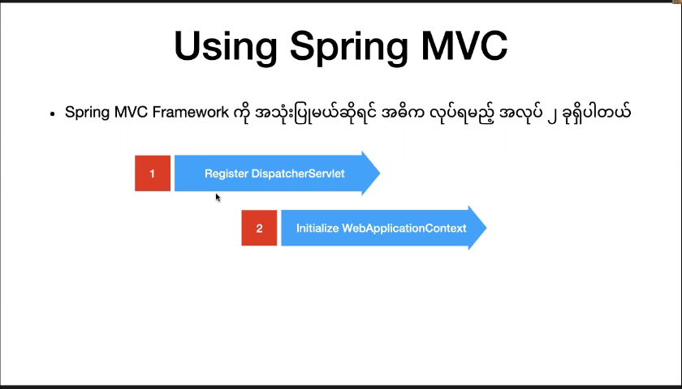
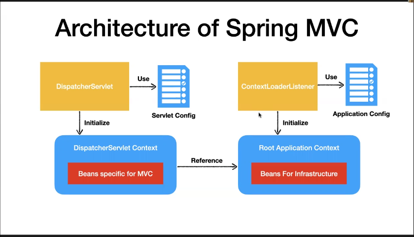

## Using DispatcherServlet

## Servlet

- `Servlets are designed to handle the request-response cycle for web applications.` `

- `When a client sends an HTTP request to a server, the servlet container (part of the web server or application server) invokes the appropriate servlet to handle the request. The servlet processes the request, performs any necessary computation or data access, and generates an HTTP response that is sent back to the client.`

- `Key characteristics and features of servlets include:`

  - **`Server-Side Processing`**: `Servlets are executed on the server side, allowing them to perform tasks such as processing form data, interacting with databases, and generating dynamic content.`
  - **`Lifecycle Methods`**: `Servlets have lifecycle methods that are invoked at different stages of their existence. The main methods include init(), service(), and destroy(). These methods allow developers to initialize resources, handle requests, and clean up resources when the servlet is no longer needed.`
  - **`Request and Response Handling` **:` Servlets handle HTTP requests and generate HTTP responses. They can process various types of requests (e.g., GET and POST) and can generate dynamic content, including HTML, XML, or other types of data.`
  - **`Servlet Container`**: `Servlets run within a servlet container, which is part of a web server or application server. The servlet container manages the lifecycle of servlets, handles incoming requests, and manages the threading model for concurrent requests.`
  - **`URL Mapping`** : `Servlets are typically mapped to specific URL patterns, allowing the servlet container to determine which servlet should handle a particular request. This mapping can be configured using deployment descriptors (e.g., web.xml) or annotations.`
  - **`Session Management`** : `Servlets can manage user sessions, allowing stateful interactions between the server and clients.`
  - **`Integration with Other Java Technologies` ** : `Servlets can be integrated with other Java technologies like JavaServer Pages (JSP) to create powerful and modular web applications.`
  
- **`lifecycle of a servlet`**

  - **`Initialization (init method)`** : `The servlet is initialized, and any necessary resources are set up.`

  - **`Request Handling (service method)`** `The servlet processes incoming requests. The service method is called for each request, and it, in turn, calls the appropriate method (e.g., doGet, doPost) based on the type of HTTP request`.

  - **`Response Generation:`** `The servlet generates a response dynamically, which is sent back to the client.`

  - **`Destruction (destroy method)`** : `The servlet is eventually destroyed, and any cleanup activities are performed.`

    `By handling requests and generating responses, servlets provide a powerful mechanism for building dynamic and interactive web applications using Java.`


### DispatcherServlet

- `The` **`DispatcherServlet`** `is part of the Spring Framework`

- `In the context of Spring MVC (Model-View-Controller), the `**`DispatcherServlet`** `acts as the front controller, responsible for dispatching requests to the appropriate handlers (controllers) and managing the overall request processing workflow.`

- `It's configured in the Spring application context and typically mapped to intercept all requests (using a URL pattern like /).`

- `The DispatcherServlet works in conjunction with other components in the Spring MVC framework, such as controllers, views, and model objects, to handle and process web requests.`

  `Example Spring DispatcherServlet configuration in a web.xml file`

  ```xml
  <servlet>
      <servlet-name>dispatcher</servlet-name>
      <servlet-class>org.springframework.web.servlet.DispatcherServlet</servlet-class>
      <init-param>
          <param-name>contextConfigLocation</param-name>
          <param-value>/WEB-INF/dispatcher-servlet.xml</param-value>
      </init-param>
      <load-on-startup>1</load-on-startup>
  </servlet>
  
  <servlet-mapping>
      <servlet-name>dispatcher</servlet-name>
      <url-pattern>/</url-pattern>
  </servlet-mapping>
  
  ```

  

- DispatcherServlet  ကို Register လုပ်၍ ထို Servlet ကို ServletConfig နဲ့  Initialize လုပ်ပါ

  ```js
  //AppInitilizer.js
  package com.shineshine.mapping;
  
  import org.springframework.web.servlet.support.AbstractAnnotationConfigDispatcherServletInitializer;
  
  public class AppInitilizer extends AbstractAnnotationConfigDispatcherServletInitializer{
  
      //Root Application Context Config
  	@Override
  	protected Class<?>[] getRootConfigClasses() {
  		return null;
  	}
  
  	// Initialize ServletConfig
  	@Override
  	protected Class<?>[] getServletConfigClasses() {
  		return new Class<?>[] {ServletConfig.class};
  	}
  
      //Mappings
  	@Override
  	protected String[] getServletMappings() { 
  		return new String[]  {"/"};
  	}
  
  }
  
  ```

  ```js
  //ServletConfig.js
  package com.shineshine.mapping;
  
  import org.springframework.context.annotation.ComponentScan;
  import org.springframework.context.annotation.Configuration;
  import org.springframework.web.servlet.config.annotation.EnableWebMvc;
  import org.springframework.web.servlet.config.annotation.ViewControllerRegistry;
  import org.springframework.web.servlet.config.annotation.ViewResolverRegistry;
  import org.springframework.web.servlet.config.annotation.WebMvcConfigurer;
  
  @Configuration
  @EnableWebMvc
  @ComponentScan("com.shineshine.mapping.controller")
  public class ServletConfig implements WebMvcConfigurer{
  
      //Point View folder and View extensiton
  	@Override
  	public void configureViewResolvers(ViewResolverRegistry registry) {
  		registry.jsp().prefix("/jsp/").suffix(".jsp");
  	}
  }
  
  ```

  


