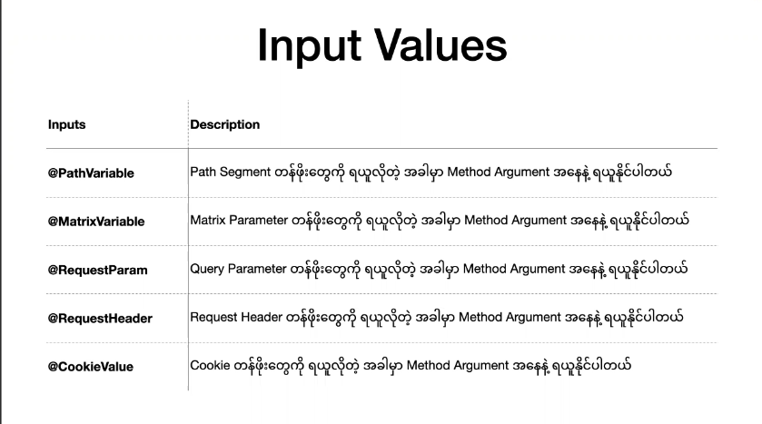
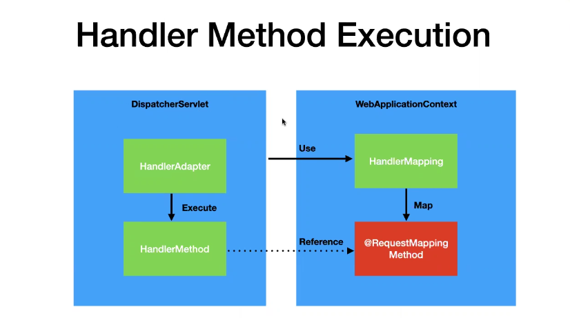
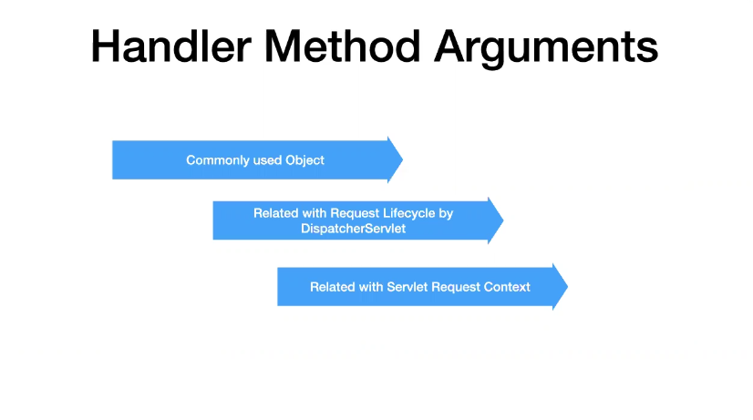

##  Method Arguments




### @PathVariable With String & Integer Type

```java
package com.shineshine.mapping.controller;

import org.springframework.stereotype.Controller;
import org.springframework.ui.ModelMap;
import org.springframework.web.bind.annotation.GetMapping;
import org.springframework.web.bind.annotation.RequestMapping;
import org.springframework.web.bind.annotation.RequestMethod;

@Controller 
@RequestMapping("post")
public class MultiActionController {
	
    /**
     * method : get
     * url : http://localhost:8080/post/findbyid/ONLY_DIGIT_POST_ID_HERE
     * view will bet : /jsp/postdetail.jsp
     */
    @GetMapping("findbyid/{id:\\d+}") 
	public String findById(
        @PathVariale("id")  Integer postId,
        Model model
    ) {
        model.addAttribute("id",postId);
        return "postdetail";
	}
    
   
    /* get PathVariale with shorthand way
    * Mapping လုပ်တဲံ Name နဲ့ Method တွင်သုံးသည့် Name နှစ်ခု တူညီရင် @PathVariale တွင် Name သတ်မှတ်စရာမလို
    */
    /**
     * method : get
     * url : http://localhost:8080/post/search/keywordhere
     * view will bet : /jsp/postlist.jsp
     */
    @GetMapping("search/{keyword}") 
	public String search(
        @PathVariale String keyword.
        Model model 
    ) {
        model.addAttribute("keyword",keyword)
        return "postlist";
	}
    
   
    /**
     * method : get
     * url : http://localhost:8080/post/get/ONLY_DIGIT_TAG_ID_HERE/KEYWORD_HERE
     * view will bet : /jsp/postlist.jsp
     */
    @GetMapping("get/{tag:\\d+}/{keyword}") 
	public String search(
        @PathVariable("tag") Integer category_id,
        @PathVariale  String keyword.
        Model model 
    ) {
        model.addAttribute("tag",category_id);
        model.addAttribute("keyword",keyword);
        return "postlist";
	}
     
}
```


### @PathVariable With LocalDate Type

- `Request တွင်ပါလာသော date string("2023-10-28") များကို   Handler Method တွင် LocalDate အဖြစ် ဖမ်းခြင်လျှင်` **`@DateTimeFormat(pattern = "yyyy-MM-dd")`** ` သုံးရပါမယ်`

```java
package com.shineshine.mapping.controller;

import org.springframework.stereotype.Controller;
import org.springframework.ui.ModelMap;
import org.springframework.web.bind.annotation.GetMapping;
import org.springframework.web.bind.annotation.RequestMapping;
import org.springframework.web.bind.annotation.RequestMethod;

@Controller 
@RequestMapping("post")
public class MultiActionController {
   
    /* Mapping လုပ်တဲံ Name နဲ့ Method တွင်သုံးသည့် Name နှစ်ခု တူညီရင် @PathVariale တွင် Name သတ်မှတ်စရာမလို*/
   
    /**
     * Method : get
     * Url : http://localhost:8080/post/searchByDate/2023-10-28
     * View will bet : /jsp/postlist.jsp
     */
    @GetMapping("searchByDate/{date}") 
	public String search(
        @PathVariale @DateTimeFormat(pattern = "yyyy-MM-dd") LocalDate date,
        Model model 
    ) {
        model.addAttribute("date",date)
        return "postlist";
	}
    
    /**
     * Method : get
     * Url : http://localhost:8080/post/searchByDate/reg/YEAR-MONTH-DAY-FORMAT
     * View will bet : /jsp/postlist.jsp
     */
    @GetMapping("searchByDate/reg/{date:\\d{4}\\-\\d{2}\\-\\d{2}}") 
	public String search(
        @PathVariale @DateTimeFormat(pattern = "yyyy-MM-dd") LocalDate date,
        Model model 
    ) {
        model.addAttribute("date",date)
        return "postlist";
	}
     
}
```


### @PathVariable With Enum Type

```java
package com.shineshine.mapping.enum;
public enum Level{
    Basic,Intermediate,Advance;
}

------------------------------------------------------

package com.shineshine.mapping.controller;

import org.springframework.stereotype.Controller;
import org.springframework.ui.ModelMap;
import org.springframework.web.bind.annotation.GetMapping;
import org.springframework.web.bind.annotation.RequestMapping;
import org.springframework.web.bind.annotation.RequestMethod;

@Controller 
@RequestMapping("course")
public class MultiActionController {
     
    /**
     * Method : get
     * Url : http://localhost:8080/course/getBy/Basic
     * 	     http://localhost:8080/course/getBy/Intermediate
     * View will bet : /jsp/courses.jsp
     */
    @GetMapping("getBy/{level}") 
	public String usingEnum(
        @PathVariale  Level level,
        Model model 
    ) {
        model.addAttribute("Course Type",level)
        return "courses";
	}
    
    
     /** Nrrow Down
     * Method : get
     * Url : http://localhost:8080/course/getBy/Basic
     * 	     http://localhost:8080/course/getBy/Intermediate
     * View will bet : /jsp/courses.jsp
     */
    @GetMapping("getBy/{level:Basic|Intermediate|Advance}") 
	public String usingEnum(
        @PathVariale("level")  Level type,
        Model model 
    ) {
        model.addAttribute("Course Type",type)
        return "courses";
	}
     
}
```


### @RequestParam

```java
package com.shineshine.mapping.controller;

import org.springframework.stereotype.Controller;
import org.springframework.ui.ModelMap;
import org.springframework.web.bind.annotation.GetMapping;
import org.springframework.web.bind.annotation.RequestMapping;
import org.springframework.web.bind.annotation.RequestMethod;

@Controller 
@RequestMapping("product")
public class MultiActionController {

     /**
     * Method : get
     * Url : http://localhost:8080/product/detail?name="Product name"&c="Black"
	 * 					or          
     * 	      http://localhost:8080/product/detail?name="Product name"
     * View will bet : /jsp/products.jsp
     */
    @GetMapping("detail") 
	public String getDetail(
        @RequestParam  String name,
        @RequestParam( name = "c", required = false , defaultValue = "white" )  String color,
        // or 
      //@RequestParam( value = "c", required = false , defaultValue = "white" )  String color,
        Model model 
    ) {
        var detail = "Product : %s,Color: %s".formatted(name,color)
        model.addAttribute("detail",detail)
        return "products";
	}
  
}
```


###  @MatrixVariable

- `URL အတွင်း semicolon(;) နောက်က Matrix Value များကို Method Arguments အဖြစ်သုံးခြင်လျှင်  ` **`ServletConfig`** တွင် `RequestMapingHandlerMaping ကို requestMapingHandlerMaping Bean Name အနေနဲ့ Override လုပ်ပြီး  Bean ပြန်ဆောက်ပေးဖို့လိုပါတယ်`

  ######  Override RequestMapingHandlerMaping Bean

  ```js
  //ServletConfig.js
  package com.shineshine.mapping;
  
  import org.springframework.context.annotation.ComponentScan;
  import org.springframework.context.annotation.Configuration;
  import org.springframework.web.servlet.config.annotation.EnableWebMvc;
  import org.springframework.web.servlet.config.annotation.ViewControllerRegistry;
  import org.springframework.web.servlet.config.annotation.ViewResolverRegistry;
  import org.springframework.web.servlet.config.annotation.WebMvcConfigurer;
  
  @Configuration
  @EnableWebMvc
  @ComponentScan("com.shineshine.mapping.controller")
  public class ServletConfig implements WebMvcConfigurer{
  
      //Point View folder and View extensiton
  	@Override
  	public void configureViewResolvers(ViewResolverRegistry registry) {
  		registry.jsp().prefix("/jsp/").suffix(".jsp");
  	}
      
      @Bean(name="requestMapingHandlerMaping")
      public void RequestMapingHandlerMaping mapping() {
  		var mapping = new RequestMapingHandlerMaping();
          mapping.setRemoveSemicolonContent(false);
          return mapping;
  	}
  }
  
  ```
  
  `mapping`
  
  ```java
  package com.shineshine.mapping.controller;
  
  import org.springframework.stereotype.Controller;
  import org.springframework.ui.ModelMap;
  import org.springframework.web.bind.annotation.GetMapping;
  import org.springframework.web.bind.annotation.RequestMapping;
  import org.springframework.web.bind.annotation.RequestMethod;
  
  @Controller 
  @RequestMapping("product")
  public class MultiActionController {
       
      /**
       * Method : get
       * Url : http://localhost:8080/product/detail/product_name;size=L;c=white
       * View will bet : /jsp/products.jsp
       */
      @GetMapping("detail/{name}") 
  	public String getDetail(
          @PathVariale  String name,
          @MatrixVariable String size,
          @MatrixVariable(name="c") String color,
          Model model 
      ) {
          var detail = "Product : %s,Size : %s,Color: %s".formatted(name,size,color)
          model.addAttribute("detail",detail)
          return "products";
  	}
      
       /**
       * Method : get
       * Url : http://localhost:8080/product/detail/product_name;size=L;color=white
  	 * 					or          
       * 	      http://localhost:8080/product/detail/product_name;size=L
       * View will bet : /jsp/products.jsp
       */
      @GetMapping("detail/{name}") 
  	public String getDetail(
          @PathVariale  String name,
          @MatrixVariable String size,
          @MatrixVariable(required = false,defaultValue = "white") String color,
          Model model 
      ) {
          var detail = "Product : %s,Size : %s,Color: %s".formatted(name,size,color)
          model.addAttribute("detail",detail)
          return "products";
  	}
      
      //using pathVar
  
       
  }
  ```
  







