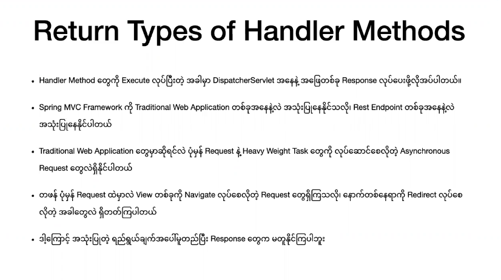
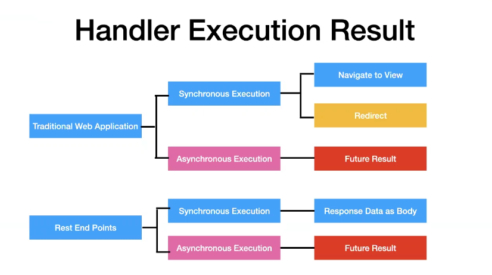
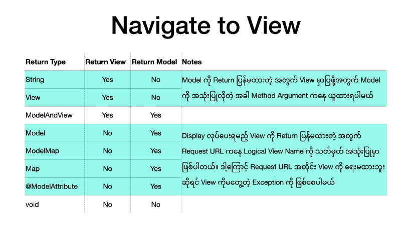
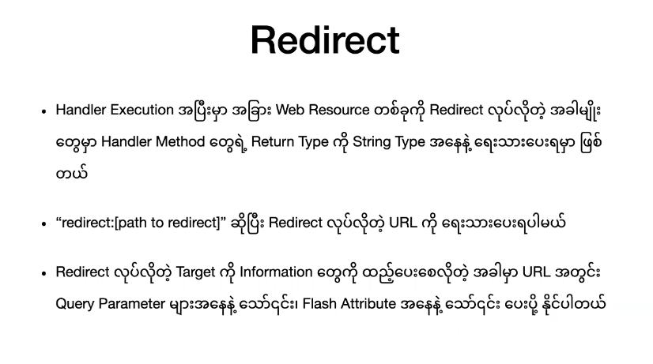
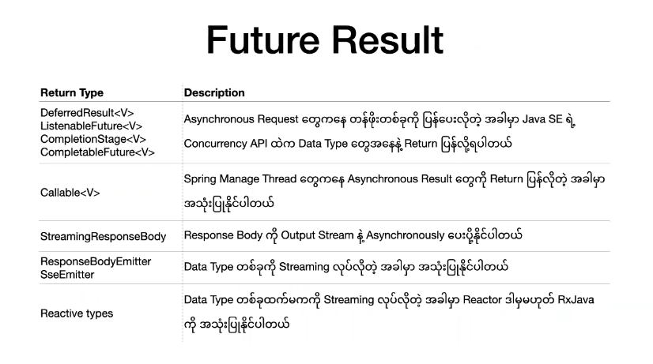
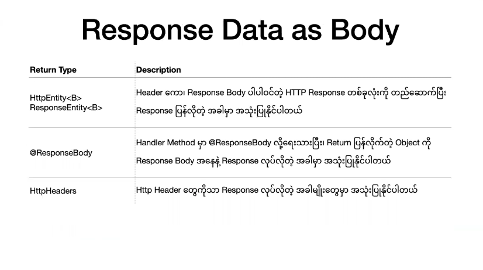

##  Handler Method Return Type





----



```java
package com.shineshine.mapping.controller;

import org.springframework.stereotype.Controller;
import org.springframework.web.bind.annotation.GetMapping;
import org.springframework.web.bind.annotation.RequestMapping;
import org.springframework.web.bind.annotation.RequestMethod;

@Controller 
@RequestMapping("post")
public class MultiActionController {
	
    @Autowired
    private PostService postService;
    
    //Return View Only 
    /**
     * method : get
     * url : http://localhost:8080/post/index
     * view will bet : /jsp/index.jsp
     */
    @GetMapping("index") 
	public String index() {
        return "index";
	}
    
    //Return View With Date
    /**
     * method : get
     * url : http://localhost:8080/post/showPosts
     * view will bet : /jsp/index.jsp
     */
    @GetMapping("showPosts") 
	public String list(Map<String,Object> model) {
        model.put("posts".postService.getAll());
        return "index";
	}
    
    //Return View With Date (ModelMap )
    /**
     * method : get
     * url : http://localhost:8080/post/getAll
     * view will bet : /jsp/index.jsp
     */
    @GetMapping("getAll") 
	public String showPost(ModelMap model) {
        model.put("posts".postService.getAll());
        return "index";
	}
    
    
    //Return ModelAndView
    /**
     * method : get
     * url : http://localhost:8080/post/getPosts
     * view will bet : /jsp/postlist.jsp
     */
    @GetMapping("getPosts") 
	public ModelAndView postLists() {
        var modelAndView = new ModelAndView();
        modelAndView.getModel().put("posts".postService.getAll());
        modelAndView.setViewName("postlist"); //Set Logical view name
        return modelAndView;
	}
    
    /* Return Void
     * Handler  Method မှာ Return type Void ပေးထားလျှင် View name ကို URL က နေ ကြည့် ပြီးတော့ jsp Foler အောက်တွင် ရှာပြီး view 		   objet ကို resolve လုပ်ပေးသည် အကယ်၍ URL က ပါတဲံ View name က jsp Foler အောက်တွင် မရှိရင်တော့ exception တတ်
	*/        
    
    /**
     * method : get
     * url : http://localhost:8080/post/index
     * view will bet : /jsp/index.jsp
     */
    @GetMapping("index") 
    public void show(ModelMap model) {
        model.put("posts".postService.getAll());
    }
    

}
```
----



```java
package com.shineshine.mapping.controller;

import org.springframework.stereotype.Controller;
import org.springframework.web.bind.annotation.GetMapping;
import org.springframework.web.bind.annotation.RequestMapping;
import org.springframework.web.bind.annotation.RequestMethod;

@Controller 
@RequestMapping("post")
public class MultiActionController {
	
    @Autowired
    private PostService postService;
    @GetMapping("index") 
    public String showPost(ModelMap model) {
        model.put("posts".postService.getAll());
        return "index";
	}
    
    /**
     * Method : post
     * url : http://localhost:8080/post/store?title="this title"&desc="this is desc"
     * view : /jsp/index.jsp
     */
    @PostMapping("store")
    public String storePost(
        @RequestParam String title, 
        @RequestParam("desc") String description, 
    ) {
        Post post = new Post(title,description);
        postService.store(post);
        return "redirect;index";
	}
}
```


#### Redirecting and @RedirectAttribute

- `Redirecting လုပ်လိုက်သော Request ထဲသို့ Dataများ ထည့်ချင်လျှင် @RedirectAttribute ကို Handler Method Arguments  အတွင်း ယူပြီးတော့ Data များထည့်လို့ရပါတယ်`

- `RedirectAttribute တွင်  addAttribute() method နဲ့  addFlashAttribute()  method ဆိုပြီး နှစ်ခုရှိပါသည်`

  - `addAttribute() method သည် pass လုပ်လိုက်သော Data များကို URL က နေ ယူသွားပြီးတော့  pass လုပ်လိုက်သော Data  များကို   URL  တွင် တွေ့နိုပါည်။ addAttribute() method သည် String များ  Value များကိုသာ လက်ခဲ့ပါသည်`
  - `addFlashAttribute() pass လုပ်လိုက်သော Data  များကို URL  တွင် မမြင်ရပါ။ addFlashAttribute() method သည် String များသာ မက Object များကိုလည်း လက်ခံနိင်ပါသည်`

  ```java
  @Autowired
  private PostService postService;
  /**
  * Method : post
  * url : http://localhost:8080/post/store?title="this title"&desc="this is desc"
  * view : /jsp/index.jsp
  */
  @PostMapping("store")
  public String storePost(
      @RequestParam String title, 
      @RequestParam("desc") String description, 
      
      @RedirectAttribute redirect
  ) {
      Post post = new Post(title,description);
      postService.store(post);
      
      redirect.addAttribute("message","Post Created")
  	redirect.addFlashAttribute("result",post)
      return "redirect;index";
  }
  
  /**
  * Method : get
  * url : http://localhost:8080/post/index"
  * view : /jsp/index.jsp
  */
  @GetMapping("index") 
  public String showPost(ModelMap model) {
      model.put("posts".postService.getAll());
      return "index";
  }
  
  
  //jsp/index.jsp
  ${message}
  ${result.title}
  ```

  







