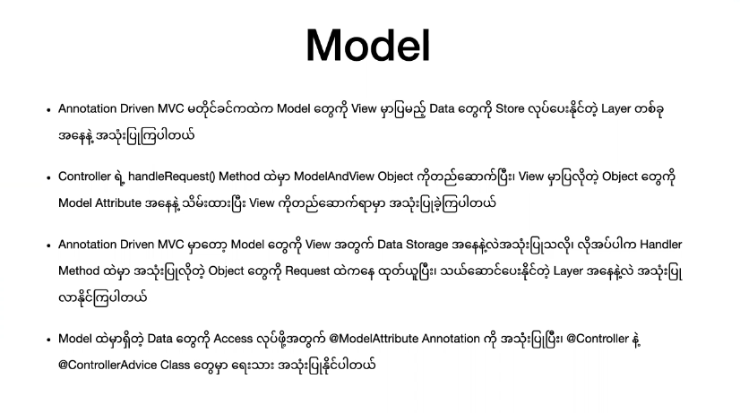
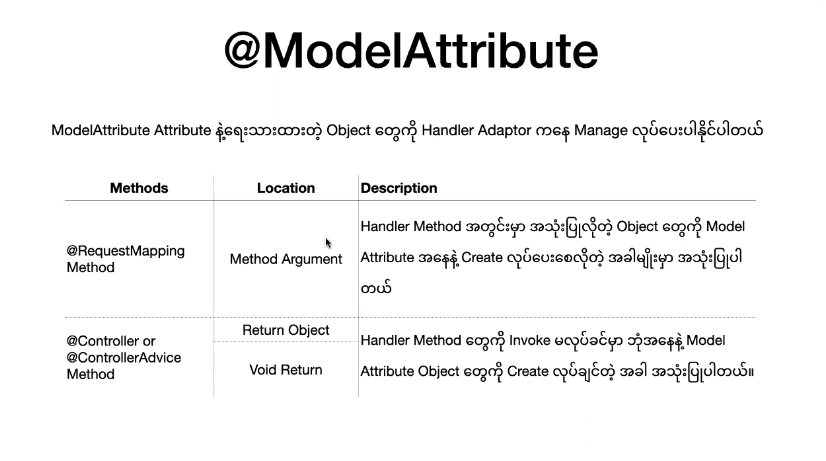

## Model ,Scope Bean & Attributes




### @ModelAttribute



##### @ModelAttribute

```java
// dto/PostDTO.java
@Data //Lombok 
@NoArgsConstructor
@AllArgsConstructor
class PostDTO{
    private String title,
    private String desc,
}


------------------------------------------------------------------------------------------------------------
//controller/PostController.java
@Autowired
private PostService postService;
/**
* Method : post
* url : http://localhost:8080/post/store?title="this title"&desc="this is desc"
* view : /jsp/index.jsp
*/
@PostMapping("store")
public String storePost(
    @RequestParam String title, 
    @RequestParam("desc") String description, 
) {
    Post post = new Post(title,description);
    postService.store(post);
    return "redirect;index";
}

/**
* Method : post
* url : http://localhost:8080/post/store-with-model-attribute?title="this title"&desc="this is desc"
* view : /jsp/index.jsp
*/
@PostMapping("store-with-model-attribute")
@PostMapping("store")
public String storePost(
    @ModelAttribut PostDTO post
    @RedirectAttribute redirect
) {
    postService.store(post);
    redirect.addAttribute("message","Post Created")
	redirect.addFlashAttribute("result",post)
    return "redirect;index";
}

//Return View Only 
/**
* method : get
* url : http://localhost:8080/post/index
* view will bet : /jsp/index.jsp
*/
@GetMapping("index") 
public String index() {
    return "index";
}

------------------------------------------------------------------------------------------------------------
    
    
//jsp/index.jsp
${message}
${result.title}
```

```java
// enum/Target.java
public enum Target{
    Private,Friend,Public;
}

------------------------------------------------------------------------------------------------------------
//controller/PostController.java
@Controller 
@RequestMapping("post")
class PostController{
    
    /**
    * method : get
    * url : http://localhost:8080/post/create
    * view will bet : /jsp/create.jsp
    */
    @GetMapping("create") 
    public String showCreatePostForm() {
        return "create";
    }
    
    @ModelAttribute("targets")
    public Target[] LoadTargetValues(){
       	return Target.values();
    }
    
    //Or
    
    @ModelAttribute
    public void LoadTargetValues2(ModelMap model){
       	model.put("targets2",Target.values());
    }
}

------------------------------------------------------------------------------------------------------------

//jsp/create.jsp
<select>
    <c:forEach var="target" items"${targets}" >
        <option value="${target}">${target}</option>
    </c:forEach>
</select>
        
<select>
    <c:forEach var="target" items"${targets2}" >
        <option value="${target}">${target}</option>
    </c:forEach>
</select>
```


### @SessionAttributes

```java
//model/Product.java
class Product implements Serializable{
    private static final long serialVersionUID = 1l;
    private List<String> list;    
    public Product(){
        list = new ArrayList<>();
    }
    public List<String> getList(){
        return list;
    }
    public int  getCount(){
        return list.size();
    }   
}
------------------------------------------------------------------------------------------------------------
    
//controller/ProductController.java
@Controller 
@RequestMapping("product")
@SessionAttributes("card")   
class ProductController{
    
    /**
    * method : Get
    * url : http://localhost:8080/product
    * view will bet : /jsp/product.jsp
    */
    void index (){}
  
    @ModelAttribute("card")
    Product loadProduct(){
        return new Product();
    }    
}
------------------------------------------------------------------------------------------------------------
    
//controller/AddCardItemController.java
@Controller 
@RequestMapping("product/card")
class AddCardItemController{
    
    /**
    * method : Post
    * url : http://localhost:8080/product/card/add-item
    * view will bet : /jsp/product.jsp
    */
    @PostMapping("add-item") 
    String addCardItem(@RequestParam  String name,@SessionAttribute Product card ) {
        card.add(name);
        return "product";
    }   
}
---------------------------------------------------------------------------------------------------------------

//controller/ClearCardItemController.java
@Controller 
@RequestMapping("product/card")
@SessionAttributes("card")   
class ClearCardItemController{
    
    /**
    * method : Post
    * url : http://localhost:8080/product/card/clear-item
    * view will bet : /jsp/product.jsp
    */
    @PostMapping("clear-item") 
    String addCardItem(@RequestParam  String name,@SessionStatus session ) {
        session.setComplete();
        return "product";
    }   
}    
---------------------------------------------------------------------------------------------------------------
    
//jsp/product.jsp
<form action="product/card/add-item" method="post">
    <input type="text" name="name" />
    <input type="submit" value="add" />
</form> 
    
<form action="product/card/clear-item" method="post">
    <input type="submit" value="clear" />
</form> 
    

${sessionScope.card.count}
<c:forEach var="item" items"${sessionScope.card.list}" >
    ${item}
</c:forEach>
```


