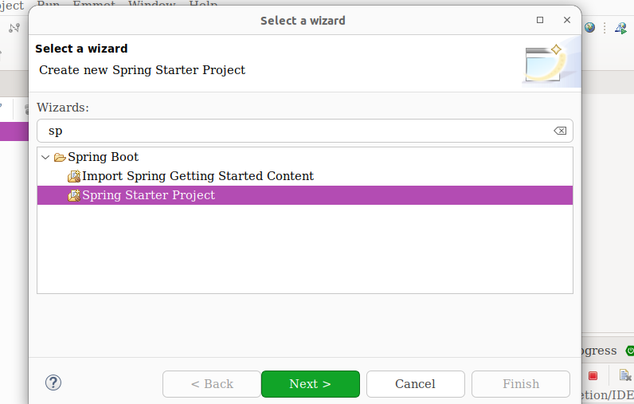
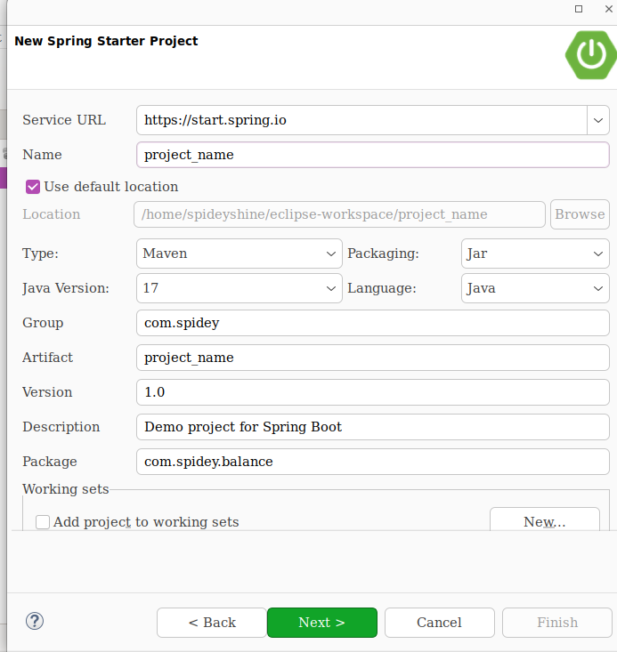
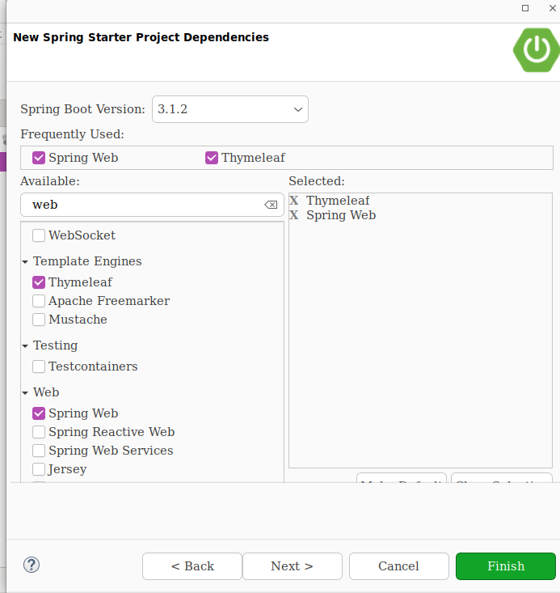
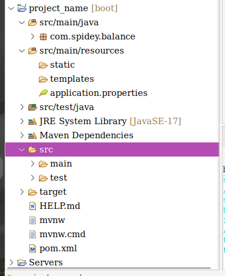
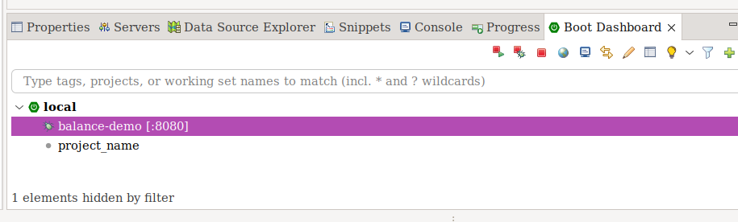

### Install Eclipse IDE

### Install Necessary Plug-in

- `Spring Tool suite 4 plugin` :**` for create Spring boot project`**
- `Lombok-annotation-processor :` **` Auto Fill for getter and setter`**
- `Emmet-plugin `: **` Auto Fill for Html `  **
- `Thymeleaf-plugin` : **``Thymeleaf Template Engine auto complete  `**  
- `WTP-Web-Resources `: **`html css bootstartp auto suggestion`**

### Create Project

- `To  open Select a Wizard => Ctrl + N`

- `Type :  Spring `

- `Select : Spring Starter Project  `

  

-  `Type Your Project Name and Package Name`
- `Click Next`

- `Select Dependence`

  

- `Created Project Folder Structure`

  

### Run

- ` Select Your Project `
- `Click Start Icon `
- `Broswe` => http://localhost:8080/

