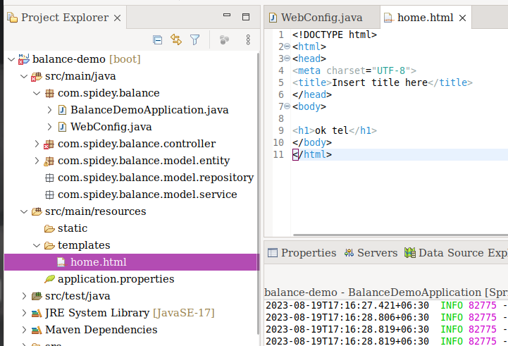

### Create WebConfig File

> `Spring မှာ Client request ကနေက view file တွေကို return ပြန်ချင်တယ်ဆိုရင် Controller ကနေလည်းပြန်လို့ရတယ် ဒါမဟုတ် Controller မသုံးပဲ direct ပြန်လို့ရပါတယ် direct ပြန်ချင်တယ်ဆိုရင် WebConfig file တစ်ခုဆောက်ပြီး URL Mapping  လုပ်ပေးဖို့လိုပါတယ်`


- `Create WebConfig.java in ` `balance-demo/src/main/java/WebConfig.java`


​	

### Add URL Mapping

- `balance-demo/src/main/java/WebConfig.java`

- ` WebConfig class must be implements WebMvcConfigurer` 

- `Add Annotation`

  - `@Configuration`
  - `@EnableWebMvc`

- `Add  addViewControllers Override Method . In this Method you cad write URL Mapping`

  

  ```java
  package com.spidey.balance;
  
  import org.springframework.context.annotation.Configuration;
  import org.springframework.web.servlet.config.annotation.EnableWebMvc;
  import org.springframework.web.servlet.config.annotation.ViewControllerRegistry;
  import org.springframework.web.servlet.config.annotation.WebMvcConfigurer;
  
  @Configuration
  @EnableWebMvc
  public class WebConfig implements WebMvcConfigurer {
  	
  	//will serve balance-demo/src/main/resources/templates/home.html
      @Override
  	public void addViewControllers(ViewControllerRegistry registry) {
  		registry.addViewController("/").setViewName("home");
  	}
  }
  ```
  
  

  

### Add templates File

-  `Create html file  in balance-demo/src/main/resources/templates/.html`

  