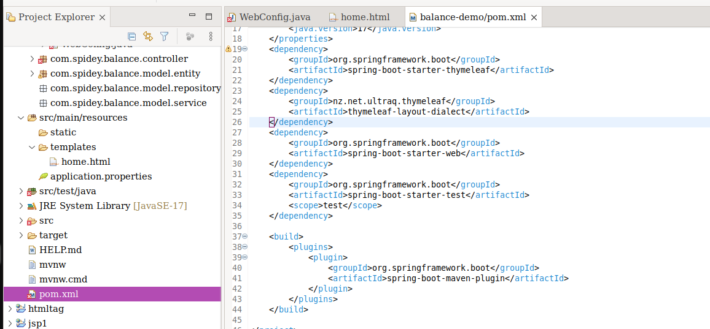

## Thymeleaf 

- `Thymeleaf  is Template Engine to bind data and html `

  

### Install Thymeleaf Layout Dialects

-  `Project ဆောက်တုန်း က  Thymeleaf  ရှိးရှိး dependency ကို ထည့်ခဲ့ပါတယ်`

- `Template တွေ Layout ချ ဖို့ ပိုမိုလွယ်ကူတဲံ  Thymeleaf Layout Dialects ကို dependency Install လုပ်နိုင်ပါတယ`

- `Install လုပ်ဖို့ pom.xml ထဲမှာ  Thymeleaf Layout Dialects xml ကိုလုပ်ပြီးတာနဲ့ Install လုပ်သွားလိမ့်မည်`

  ```xml
  <dependency>
      <groupId>nz.net.ultraq.thymeleaf</groupId>
      <artifactId>thymeleaf-layout-dialect</artifactId>
  </dependency>
  ```

  


### Create Layout 

- 