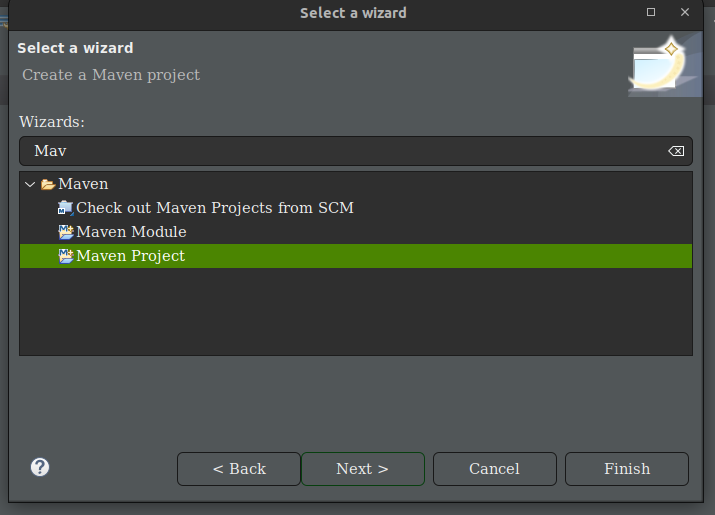
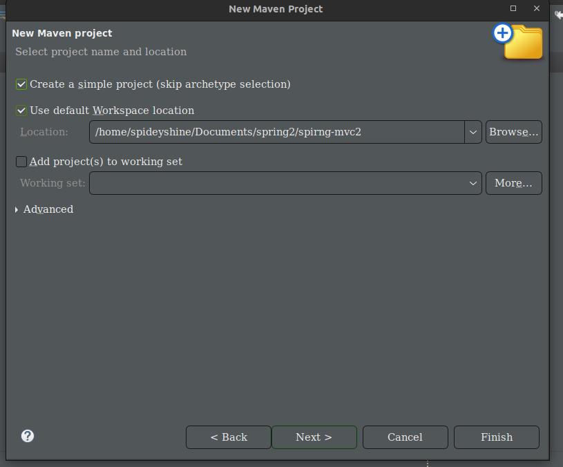
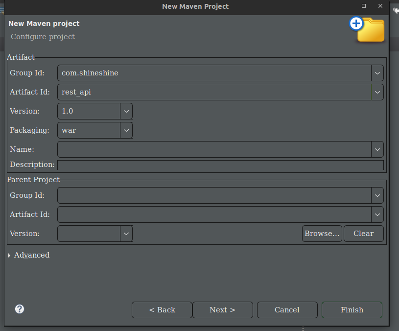

### Create Spring MVC Project with Maven

- ` Eclipes တွင် Wizard ဖွင့်ရန်  Ctrl + N နှ်ပ်ပါ`

- ` Maven လို့ရိုက်ပါ`

- `Maven Project ကိုရွေးပါ`

  


- `Create a simple ကို check လုပ်ပါ`
 


-  `Project Name and Package Name ထည့်ပါ`
-  `Packaging တွင် war ကို ရွေးပါ`
- `Click Next နှိပ်ပါ`




### Folder Structure

```js
├── pom.xml
├── src
│   ├── main
│   │   ├── java
│   │   ├── resources
│   │   └── webapp
│   └── test
│       ├── java
│       └── resources
└── target
    ├── classes
    ├── generated-sources
    │   └── annotations
    ├── generated-test-sources
    │   └── test-annotations
    ├── m2e-wtp
    │   └── web-resources
    │       └── META-INF
    │           ├── MANIFEST.MF
    │           └── maven
    │               └── com.shineshine
    │                   └── rest_api
    │                       ├── pom.properties
    │                       └── pom.xml
    └── test-classes
```

