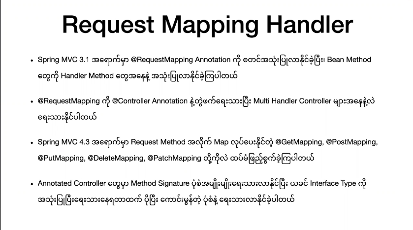

##  Request Mapping





```js
package com.shineshine.mapping.controller;

import org.springframework.stereotype.Controller;
import org.springframework.ui.ModelMap;
import org.springframework.web.bind.annotation.GetMapping;
import org.springframework.web.bind.annotation.RequestMapping;
import org.springframework.web.bind.annotation.RequestMethod;

@Controller 
@RequestMapping("multi")
public class MultiActionController {
	

    /**
     * method : get,post
     * url : http://localhost:8080/multi
     * view will bet : /jsp/multi.jsp
     */
	@RequestMapping
	public void index() {}

	
	/**
	 * method : get,post
     * url : http://localhost:8080/multi/action1
     * view will bet : /jsp/action1.jsp
     */
	@RequestMapping("action1")
	public String action1(ModelMap model) {
		model.put("message", "Message From model in action1 Handler");
		return "action1";
	}
	
    /**
	 * method : get,post
     * url : http://localhost:8080/multi/home 
     * or
     * http://localhost:8080/multi/index
     * view will bet : /jsp/home.jsp
     */
    @RequestMapping({"/home","/index"})
	public String index() {
		return "home";
	}
    
    /**
	 * method : get
     * url : http://localhost:8080/multi/action3
     * view will bet : /jsp/action1.jsp
     */
	@GetMapping("action3") //in spring 4.3 version
	public String action3(ModelMap model) {
		model.put("message", "Message From model in action3 Handler ");
		return "action1";
	}
}
```


```java
package com.shineshine.mapping.controller;

import org.springframework.stereotype.Controller;
import org.springframework.ui.ModelMap;
import org.springframework.web.bind.annotation.GetMapping;
import org.springframework.web.bind.annotation.RequestMapping;
import org.springframework.web.bind.annotation.RequestMethod;

@Controller 
@RequestMapping("multi")
public class MultiActionController {
	
	/**
	 * method : get
     * url : http://localhost:8080/multi/action2
     * view will bet : /jsp/action1.jsp
     */
	@RequestMapping(value = "action2",method = RequestMethod.GET)
	public String action2(ModelMap model) {
		model.put("message", "Message From model in action2 Handler ");
		return "action1";
	}
	

	/**
	 * method : get
     * url : http://localhost:8080/multi/action3?id=?
     * view will bet : /jsp/action1.jsp
     */
	@GetMapping(value = "action3",params = "id") //in spring 4.3 version
	public String action3WithParams(ModelMap model) {
		model.put("message", "Message From model in action3WithParams Handler ");
		return "action1";
	}
	
	
	/** 
	 * method : get,post
     * url : http://localhost:8080/multi/onlydigit
     * view will bet : /jsp/action1.jsp
     */
	@RequestMapping("{:\\d+}")
	public String onlyDigit(ModelMap model) {
		model.put("message", "Message From model in onlyDigit Handler ");
		return "action1";
	}	
	
	/**
	 * method : get,post
     * url : http://localhost:8080/multi/any/any/any
     * view will bet : /jsp/action1.jsp
     */
	@RequestMapping("**")
	public String wildCard(ModelMap model) {
		model.put("message", "Message From model in wildCard Handler ");
		return "action1";
	}
}
```


