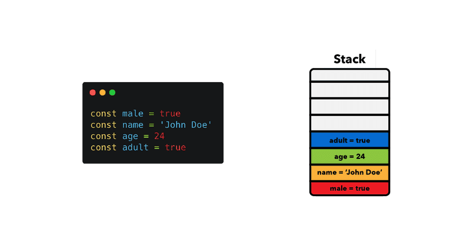

## Primitive types vs Reference Type


### Primitive types

> **`In JavaScript, a primitive value is data that is not an object and has no methods. But all primitive values (apart from null and undefined) have object equivalents that wrap around the primitive values. These wrapper objects are String, Number, BigInt, Boolean, and Symbol. These wrapper objects provide the methods that allow the primitive values to be manipulated.`**

- `string`
- `number`
- `bigint`
- `boolean`
- `undefined`
- `null`
- `symbol`

> **`Primitives are immutable: they can't be altered`**

```js
//Primitives
let name = 'Danny';
name.toLowerCase();
console.log(name); // Danny - the string method didn't mutate the string

let x = 2;
let y = 1;
x = y;
y = 100;
console.log(x); // 1 (even though y changed to 100, x is still 1)

```

> `If a primitive type is assigned to a variable, we can think of that variable as containing the primitive value. Each primitive value is stored in a unique location in memory.`



### Reference Types

- `In JavaScript, almost "everything" is an object. In fact (and confusingly), strings, numbers and booleans can be objects if defined with the new keyword`

  ```js
  let arr = [1, 3, 5, 7];
  arr.pop();
  console.log(arr); // [1, 3, 5] - the array method mutated the array
  
  
  let point1 = { x: 1, y: 1 };
  let point2 = point1;
  point1.y = 100;
  console.log(point2.y); // 100 (point1 and point2 refer to the same memory address where the point object is stored)
  ```

  

  > **`Reference types refer to a memory location where the object is stored.`**

  


### Primitive types vs Reference Types

- **`If a primitive type is assigned to a variable, we can think of that variable as containing the primitive value. Each primitive value is stored in a unique location in memory.`**
- **`Reference types refer to a memory location where the object is stored.`**

